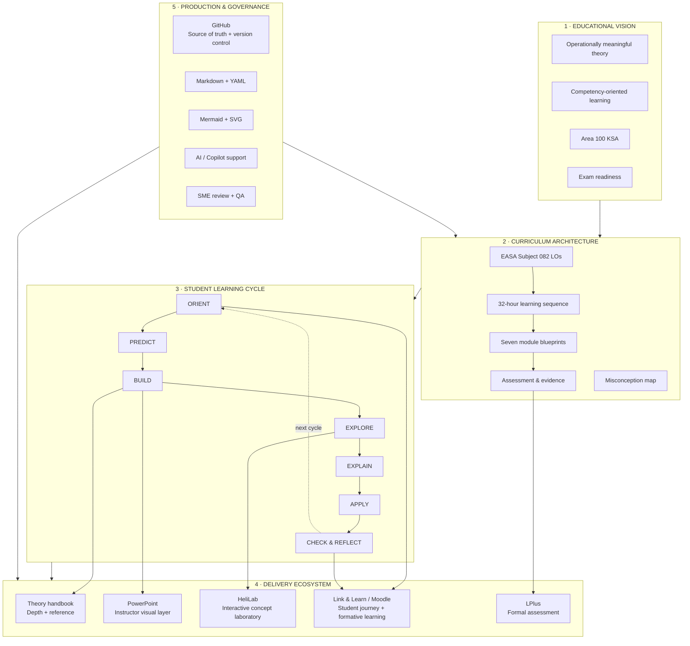
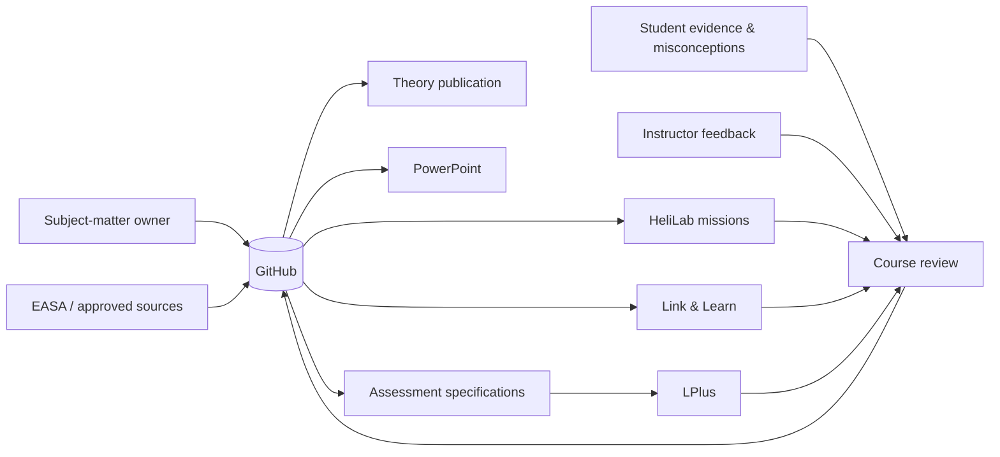

# The HeliLab Learning Ecosystem

## One-page architecture poster

The ecosystem is deliberately organised around **learning functions**, not around the software that happens to be available.

## What each tool is *for*

| Tool / medium | Primary role | Should not become |
|---|---|---|
| **GitHub** | source of truth, version control, change history, development workflow | a student LMS |
| **Handbook / theory resource** | coherent explanation, technical depth, reference | the classroom presentation |
| **PowerPoint** | instructor visual narrative, questions, staged explanation | a 200-page textbook on slides |
| **HeliLab** | prediction, manipulation, causal understanding, transfer | unstructured slider play |
| **Link & Learn** | student route, pre-work, resources, formative checks | the authoritative source of every duplicated asset |
| **LPlus** | controlled/formal assessment | the only place where learning is checked |

## Architectural decision

**Pedagogy determines tool choice; tools do not determine pedagogy.**

A new feature should therefore be justified by a learning need. For example, a HeliLab animation is useful only if it lets the learner see, manipulate or test something that is hard to understand from a static diagram.

## Information flow

This closes the loop: curriculum design produces learning experiences; evidence from those experiences feeds the next controlled revision.
