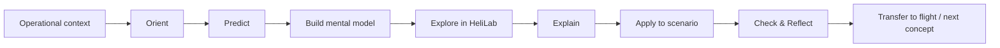

# HeliLab Learning Ecosystem — Architecture

## Purpose

This document defines the high-level architecture before individual lessons and tools are designed in detail.

## Three architecture layers

### 1. Educational vision
Define what kind of helicopter pilot the programme is trying to develop and what competent application of theoretical knowledge looks like.

### 2. Curriculum architecture
Map EASA learning objectives, prerequisite knowledge, conceptual models, scenarios, competencies/KSA behaviours, learning activities and assessment evidence.

### 3. Delivery ecosystem
Only after the first two layers are clear do we allocate activities to HeliLab, Link & Learn, instructor-led teaching, LPlus, PowerPoint or long-form documentation.

## Design rules

1. **Operational relevance first.** Each learning sequence starts by making clear why the concept matters to a helicopter pilot.
2. **Prediction before explanation.** Where appropriate, students commit to a prediction before seeing the model or answer.
3. **Theory remains rigorous.** Competency orientation does not remove theoretical knowledge; it changes how knowledge is activated and evidenced.
4. **HeliLab is a laboratory, not a digital textbook.** Students manipulate variables, observe consequences and test mental models.
5. **Assessment is distributed.** Low-stakes checks and scenario evidence support learning; formal summative assessment remains separately controlled.
6. **Visual first.** Important systems, processes and causal relationships should be understandable from a diagram before long prose is required.
7. **One source of truth.** Curriculum decisions and reusable source assets are version controlled here.

## Initial implementation

Subject 082 — Principles of Flight (Helicopters) is the pilot implementation. It should be completed and evaluated before this architecture is rolled out to additional subjects.
