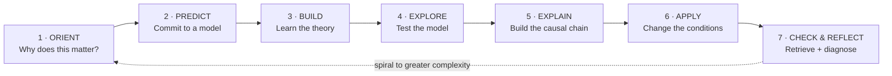
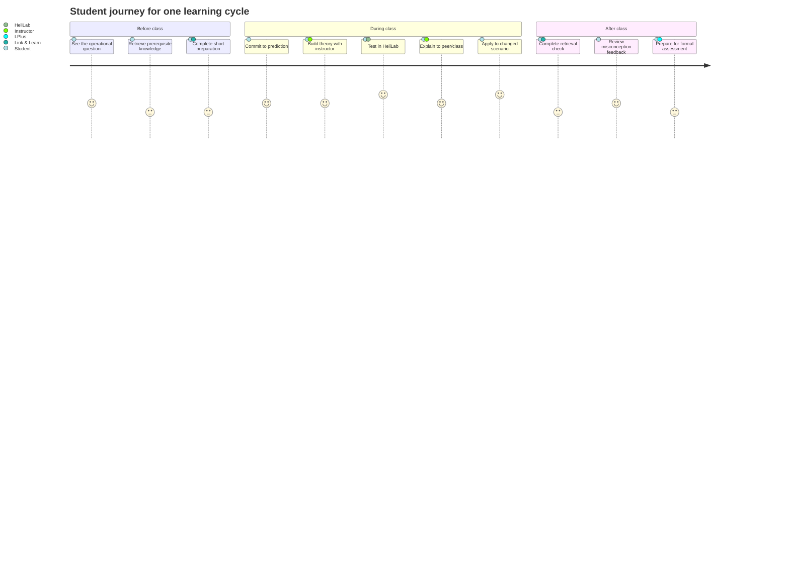
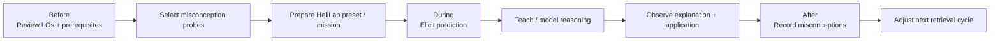
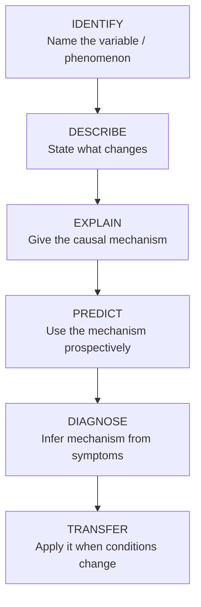

# Student Learning Journey

## The recurring learning cycle

Every module should feel familiar in *process* even when the aerodynamic content becomes more complex.

The important instructional rule is **prediction before reveal**. Students should repeatedly make their current mental model visible before the instructor, HeliLab or an answer key resolves the problem.

## Before, during and after class

## Instructor journey

## What counts as stronger learning evidence?

The course should deliberately climb this ladder. A correct multiple-choice answer can demonstrate useful knowledge, but it does not by itself show that a learner can explain, predict or transfer the underlying aerodynamic model.

## Standard learning evidence package

For important concepts, aim to collect several different forms of evidence over time:

- **Retrieval:** can the student recall the core relationship without prompts?
- **Representation:** can the student draw or interpret the relevant vector/flow diagram?
- **Explanation:** can the student articulate a technically coherent causal chain?
- **Prediction:** can the student anticipate the direction of change before using HeliLab?
- **Transfer:** can the student reason correctly when mass, density, speed, load factor or flight condition changes?
- **Exam readiness:** can the student answer the formal theoretical-knowledge question accurately and efficiently?

This is the bridge between a rigorous ATPL(H) theory course and a competency-oriented learning process.
