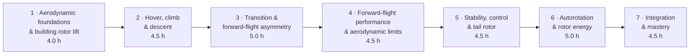
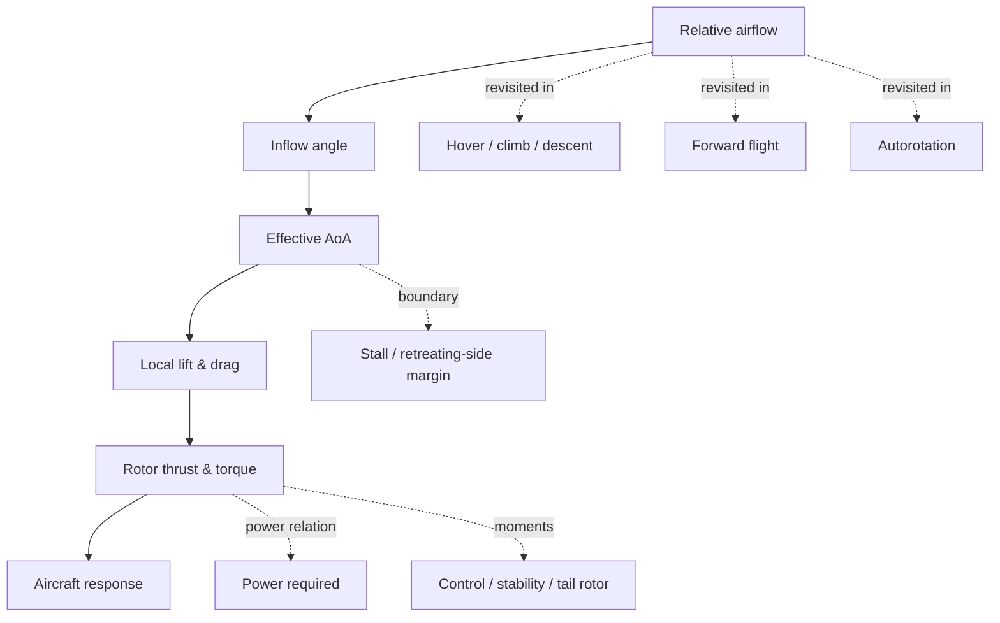
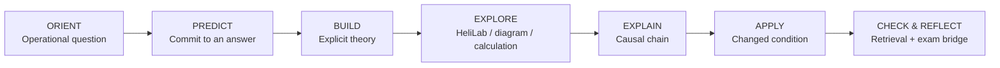
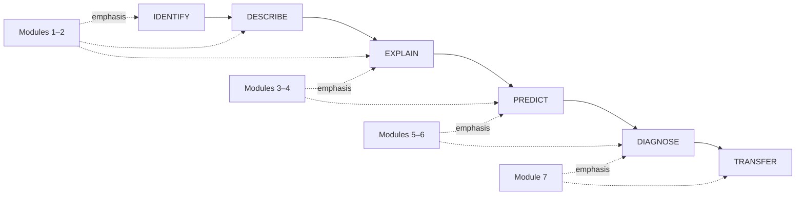

# 32-hour Principles of Flight Curriculum Map

> **Status:** working architecture. The exact allocation remains provisional until the full EASA Subject 082 LO mapping and current approved course constraints are reconciled.

The current course material already separates aerodynamic foundations from helicopter aerodynamics and uses a seven-lesson helicopter-aerodynamics sequence. The new architecture keeps that technical breadth but reorganises the learning experience around increasing aerodynamic reasoning rather than slide/chapter completion.

## Proposed course flow

**Total planned classroom time: 32.0 hours**

## Driving questions

| Module | Driving question | Main reasoning move |
|---|---|---|
| **1. Aerodynamic foundations & rotor lift** | How can a rotating blade create and control rotor thrust? | Build the core causal model |
| **2. Hover, climb & descent** | How does vertical airflow change the rotor state and power requirement? | Compare equilibrium states |
| **3. Transition & forward-flight asymmetry** | Why does the rotor remain controllable when advancing and retreating blades see different airflow? | Reason around the rotor disc |
| **4. Forward-flight performance & limits** | Which aerodynamic mechanism becomes limiting as speed and loading increase? | Integrate competing limits |
| **5. Stability, control & tail rotor** | How are helicopter forces and moments balanced and disturbed? | Diagnose coupled behaviour |
| **6. Autorotation & rotor energy** | Where does rotor energy come from without engine torque? | Track energy and torque flow |
| **7. Integration & mastery** | Can you infer the aerodynamic mechanism from symptoms and changed conditions? | Diagnose and transfer |

## Spiral concept map

The repeated reasoning chain is not a slogan; it is the conceptual backbone of the course. Each module adds a new airflow state, coupling or boundary condition while reusing the same fundamental language.

## Standard module rhythm

Not every 20-minute segment must contain all seven stages. The rule applies at lesson/module scale: students should repeatedly move from prior model to explicit theory to testable application rather than remain passive for long blocks.

## Reasoning complexity across 32 hours

## Platform pattern by module

| Phase | Primary medium | Example evidence |
|---|---|---|
| Orientation / preparation | Link & Learn | short retrieval or operational prompt |
| Explicit theory | instructor + PowerPoint + handbook | annotated diagram / worked reasoning |
| Exploration | HeliLab | committed prediction vs observed state |
| Explanation | classroom / mission card | causal chain, sketch, teach-back |
| Application | scenario / HeliLab challenge | changed-condition decision or diagnosis |
| Formative check | Link & Learn / classroom | retrieval, diagram, application item |
| Formal assessment | LPlus where required | controlled item / progress evidence |

## Design constraint

The formal EASA theoretical-knowledge scope remains a non-negotiable coverage requirement. This map becomes final only after each Subject 082 LO has a primary teaching location, retrieval location and assessment/evidence route.
