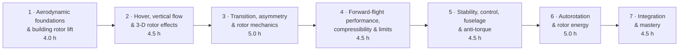
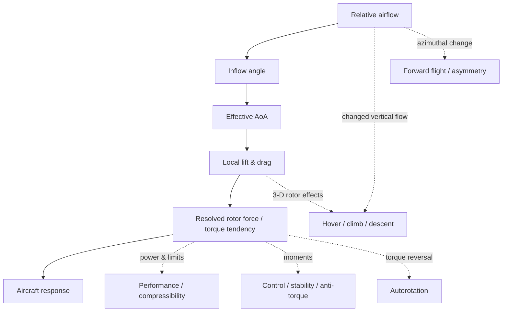
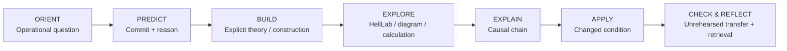
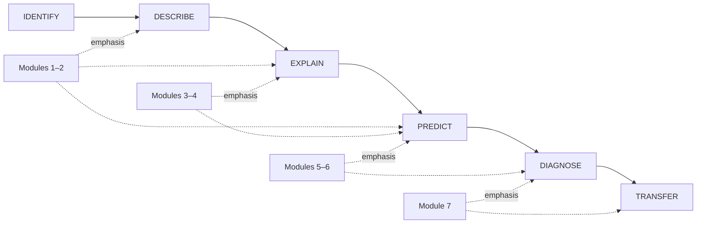

# 32-hour Principles of Flight Curriculum Map

> **Status:** working architecture. The 32-hour envelope is retained, but module scope is now load-balanced against the reconciled Subject 082 LO map. Exact segment timing beyond Module 1 remains provisional until each module is prototyped and piloted.

The architecture organises Subject 082 around increasing aerodynamic reasoning rather than slide/chapter completion. Every regulatory LO still requires an auditable delivery, retrieval and assessment route; a module label alone is not coverage.

## Course flow

**Total planned classroom time: 32.0 hours.** Required pre-study/reference material sits outside this contact-hour total and must be explicitly designed and retrieval-checked rather than hidden inside module labels.

## Driving questions and protected scope

| Module | Driving question | Protected contact core | Main reasoning move |
|---|---|---|---|
| **M1 · Foundations & rotor lift — 4.0 h** | How can a rotating blade create and control rotor thrust? | local airflow/aerofoil model; vrot + axial/induced component; velocity triangle; φ/θ/α; FL/FD/TAF; local resolution; unrehearsed BET transfer | **Construct the causal model** |
| **M2 · Hover, vertical flow & 3-D rotor effects — 4.5 h** | How do induced/vertical flow and three-dimensional rotor effects change rotor state and power? | blade/rotor 3-D airflow and induced drag; coning; hover equilibrium/power; ground effect; climb/descent; VRS and vertical-flight limits | **Compare rotor-flow states** |
| **M3 · Transition, asymmetry & rotor mechanics — 5.0 h** | How does the rotor accommodate unequal airflow and mechanical loading around the disc? | blade forces/stresses/CTM; flapping/lag/hinges; cyclic/phase-lag concepts; uniform/non-uniform inflow; advancing/retreating asymmetry; rotor-system consequences | **Reason around the disc** |
| **M4 · Forward-flight performance, compressibility & limits — 4.5 h** | Which aerodynamic mechanism becomes limiting as speed, loading and available power change? | Mach/compressibility/shock effects; profile/planform and contamination in limit context; power/speed; VNE/V-n/manoeuvring; limited power; overpitch/overtorque; powered flare | **Integrate competing limits** |
| **M5 · Stability, control, fuselage & anti-torque — 4.5 h** | How are helicopter forces and moments balanced, controlled and disturbed? | fuselage airflow; anti-torque; tail-rotor/Fenestron/NOTAR concepts; equilibrium; static/dynamic stability; control power; coupled behaviour and diagnostic symptoms | **Diagnose coupled behaviour** |
| **M6 · Autorotation & rotor energy — 5.0 h** | Where does rotor energy come from without engine torque? | vertical and forward autorotation; driving/driven regions; rotor-energy/torque flow; autorotative flight/landing; configuration retrieval where useful | **Track energy and torque flow** |
| **M7 · Integration & mastery — 4.5 h** | Can you infer the aerodynamic mechanism from symptoms and changed conditions? | mixed scenarios; delayed retrieval; hazard/limit comparison; H145/application bridges; exam-format integration; unresolved misconceptions | **Diagnose and transfer** |

!!! note "Load-balance rule"
    Later modules must not become dumping grounds for material removed from M1. The protected core above is a **scope ceiling for first-pass design**. If a module cannot fit its core with prediction, construction/explanation, retrieval and transfer, content must move to pre-study/reference, another module, or trigger an explicit hour-allocation decision.

---

## LO-load review after Module 1 reconciliation

The earlier map made M1 appear to own a very large regulatory payload that its four-hour lesson did not actually teach. The reconciled LO map now separates **contact core**, **pre-study/reference** and **reassigned primary** content.

### M1 — now realistic enough to pilot

M1 is protected around the local BET reasoning chain. SI conversion and rotorcraft orientation are reference/pre-study; detailed 3-D flow, mechanics, Mach/compressibility, fuselage airflow and anti-torque have explicit later homes. The normative M1 run sheet remains the Instructor Lesson Plan.

### M2 — increased load; manage by one vertical-flow model

M2 now carries 3-D blade/rotor airflow and induced drag in addition to hover/climb/descent. This is acceptable **only if these concepts are taught as causes of the same induced/vertical-flow model**, not as a separate general-aerodynamics chapter. Ground effect and VRS become contrasting applications of rotor-flow state. Detailed power calculation should be bounded to the regulatory/course need.

### M3 — highest technical density; current risk area

M3 combines forward-flight asymmetry with the main-rotor-mechanics LO family. Five hours may be viable, but only with disciplined grouping: centrifugal/structural blade effects; flapping/cyclic/phase response; lag/hinge/rotor-system behaviour; then asymmetry/non-uniform inflow as applications. Catalogue-style rotor-system descriptions should be moved to concise reference material where possible.

**Current load flag: AMBER.** M3 is the first module to revisit after the Module 1 pilot baseline is stable.

### M4 — coherent but dense

Mach/compressibility belongs naturally with forward-flight limits. Contamination/profile/planform effects also fit here when framed as mechanisms that change margin rather than as disconnected theory. Limited-power, overpitch/overtorque and VNE/manoeuvring must remain application/limit problems rather than each becoming a standalone lecture.

**Current load flag: AMBER.** Protect causal integration; avoid expanding every limit into full operational training.

### M5 — broad but strongly integrative

Fuselage airflow, anti-torque/tail-rotor systems and stability/control share the same aircraft-level forces-and-moments frame. Tail-rotor/Fenestron/NOTAR technical layouts should use reference comparison tables; contact time should focus on aerodynamic/control consequences and diagnosis.

**Current load flag: AMBER.** Feasible if configuration catalogue knowledge is shifted to pre-study/reference.

### M6 — comparatively coherent

Five hours for autorotation and rotor energy remains defensible because the LO family is conceptually concentrated and reuses the BET model. Do not reteach M1/M2; retrieve them and change the energy/torque state.

**Current load flag: GREEN.**

### M7 — protect as integration time

M7 must not absorb untaught leftovers. It is reserved for diagnosis, transfer, retrieval and exam bridge. Any LO that first receives substantive teaching in M7 is a curriculum defect unless explicitly designated as integration-only material.

**Current load flag: GREEN only if M2–M6 deliver their primary content.**

---

## Pre-study/reference envelope

Pre-study is a deliberate delivery vehicle, not free extra capacity. Each module design must state its expected student time and retrieval check. Suitable reference/pre-study content includes terminology, configuration recognition, concise rotor-system descriptions and prerequisite quantitative conventions. Causal concepts required for transfer should not be exiled to self-study merely to make the clock fit.

The earlier Claude red-team estimate that M1 would need roughly 40 minutes of pre-study if all nominal M1 LOs remained there is no longer the design assumption: several of those LOs have now been reassigned to later modules. M1 retains a short conceptual primer plus prerequisite diagnostic; later modules will receive their own bounded reference packages.

---

## Spiral concept map

Each module changes an airflow state, coupling, mechanical response or boundary condition while reusing the same fundamental reasoning language.

---

## Standard module rhythm

Not every short segment contains every stage. At module scale, however, the student must move beyond recognition. Core prediction gates require reasoning, and each module should contain at least one task that cannot be passed by recalling the worked example.

---

## Reasoning complexity across 32 hours

---

## Platform and evidence pattern

| Phase | Primary medium | Evidence status |
|---|---|---|
| Orientation / preparation | Link & Learn / approved source pack | prerequisite/retrieval evidence as designed |
| Explicit theory | instructor + PowerPoint + handbook | annotated construction / worked reasoning |
| Exploration | HeliLab | formative thinking; session-state unless explicitly changed later |
| Explanation | classroom / mission card | causal reasoning practice; storage depends on task purpose |
| Application / transfer | scenario / worksheet / HeliLab where suitable | fresh changed-condition artefact |
| Formative retrieval | Link & Learn / classroom | delayed reconstruction / application |
| Formal assessment | LPlus where required | controlled theoretical-knowledge evidence |

HeliLab does not automatically become the formal evidence store. Its student progress tracker is not equivalent to the curriculum evidence rubric.

---

## Architecture gates before module expansion

Before a later module is considered designed, verify:

1. every primary LO has an explicit delivery vehicle;
2. pre-study/reference load is time-bounded and retrieved;
3. the contact core fits its hour allocation **with breaks/transitions**, not just content minutes;
4. at least one task requires construction/explanation rather than binary recognition;
5. transfer is not a repeated worked example;
6. HeliLab is used only where interaction adds reasoning value;
7. M7 is not being used to hide earlier coverage gaps.

## Current load decision

**Keep the 32.0-hour allocation unchanged for now.** There is not yet enough delivery evidence to justify moving hours between modules. The present risk is scope discipline, not arithmetic alone. M3, M4 and M5 are marked **AMBER** and should be prototyped against their LO clusters before any hours are reallocated. M2 is acceptable provisionally if its new 3-D content is integrated into the vertical-flow model rather than added as a separate block.

The next hour-allocation decision should be evidence-led after Module 1 pilot timing and first-pass M2/M3 blueprints exist.
