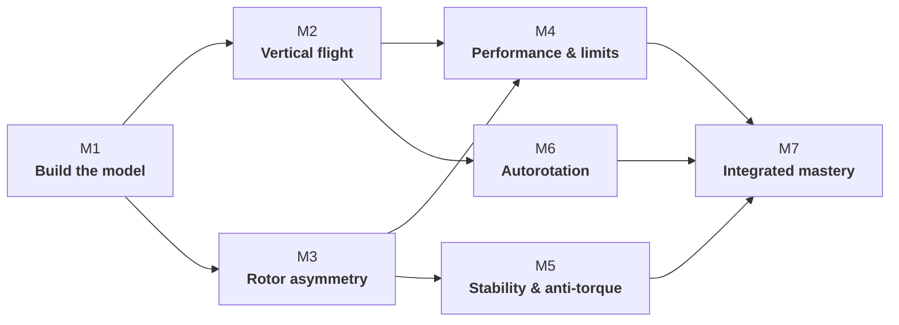

# Subject 082 — Learning Objective Mapping

## Purpose

This is the first traceability layer between the Subject 082 knowledge spine and the new 32-hour learning architecture. It is deliberately kept separate from the narrative handbook: the handbook explains the design; this page proves coverage and exposes gaps.

!!! warning "Working mapping"
    The LO codes and titles below are transcribed from the current project textbook cross-reference and must be verified against the currently applicable EASA source before the curriculum is frozen. Module allocation is a curriculum-design decision, not an EASA prescription.

## Curriculum logic

A learning objective is therefore not considered designed merely because it appears on a slide. It needs a deliberate place in the learning sequence and an appropriate form of evidence.

## Eight knowledge domains

| EASA domain | Primary curriculum home | Design note |
|---|---|---|
| **082 01 Subsonic Aerodynamics** | Module 1 | Foundation for all later blade-element reasoning |
| **082 02 Transonic Aerodynamics & Compressibility** | Modules 1 & 4 | Basic Mach concepts early; operational rotor-speed consequences later |
| **082 03 Rotorcraft Types** | Module 1 | Short orientation block; configuration differences revisited where relevant |
| **082 04 Main-Rotor Aerodynamics** | Modules 1–4 & 6 | Main conceptual spine of the course |
| **082 05 Main-Rotor Mechanics** | Modules 1, 3 & 4 | Mechanics taught where they explain aerodynamic behaviour rather than as an isolated catalogue |
| **082 06 Tail Rotors** | Module 5 | Dedicated causal sequence, with anti-torque introduced earlier |
| **082 07 Equilibrium, Stability & Control** | Module 5 | Integrated with forces, moments, CG and aircraft response |
| **082 08 Helicopter Flight Mechanics** | Modules 2, 4 & 7 | Limits and performance become transfer/application problems |

## LO → primary module map

### 082 01 — Subsonic Aerodynamics

| LO | Title | Primary | Retrieval / transfer |
|---|---|---:|---|
| 082 01 01 00 | Basic concepts, laws and definitions | M1 | All modules |
| 082 01 01 01 | SI units and conversion of units | M1 | Quantitative activities |
| 082 01 01 02 | Definitions and basic concepts about air | M1 | M2, M4 |
| 082 01 01 03 | Newton's laws | M1 | M2, M6 |
| 082 01 01 04 | Basic concepts of airflow | M1 | All rotor modules |
| 082 01 02 00 | Two-dimensional airflow | M1 | M3, M4, M6 |
| 082 01 02 01 | Aerofoil section geometry | M1 | M4 |
| 082 01 02 02 | Aerodynamic forces on aerofoil elements | M1 | M2–M6 |
| 082 01 02 03 | Stall | M1 | M2, M4 |
| 082 01 02 04 | Disturbances due to profile contamination | M1 | M4 |
| 082 01 03 00 | Three-dimensional airflow around a blade | M1 | M3, M4 |
| 082 01 03 01 | The blade | M1 | M3, M4 |
| 082 01 03 02 | Airflow pattern and influence on lift | M1 | M2–M4 |
| 082 01 03 03 | Induced drag | M1 | M2, M4 |
| 082 01 03 04 | The airflow around a fuselage | M1 | M4, M5 |

### 082 02 — Transonic Aerodynamics and Compressibility Effects

| LO | Title | Primary | Retrieval / transfer |
|---|---|---:|---|
| 082 02 01 00 | Airflow speeds and velocities | M1 | M3, M4 |
| 082 02 01 01 | Speeds and Mach number | M1 | M4 |
| 082 02 01 02 | Shock waves | M4 | — |
| 082 02 01 03 | Influence of aerofoil section and blade planform | M4 | M1 foundation |

### 082 03 — Rotorcraft Types

| LO | Title | Primary | Retrieval / transfer |
|---|---|---:|---|
| 082 03 01 01 | Rotorcraft types (autogyro vs. helicopter) | M1 | M6 |
| 082 03 02 01 | Helicopter configurations | M1 | M5 |
| 082 03 02 02 | The helicopter, characteristics and terminology | M1 | All modules |

### 082 04 — Main-Rotor Aerodynamics

| LO | Title | Primary | Retrieval / transfer |
|---|---|---:|---|
| 082 04 01 01 | Airflow through the rotor disc and around the blades | M1 | M2–M6 |
| 082 04 01 02 | Anti-torque force and tail rotor | M1 | M5 |
| 082 04 01 03 | Total power required and hover altitude OGE | M2 | M4 |
| 082 04 02 01 | Relative airflow and angles of attack in vertical climb | M2 | M6 |
| 082 04 02 02 | Power and vertical speed in climb | M2 | M4 |
| 082 04 03 01 | Airflow and forces in uniform inflow distribution | M3 | M4 |
| 082 04 03 02 | The flare (powered flight) | M4 | M6 |
| 082 04 03 03 | Non-uniform inflow distribution and inflow roll | M3 | M4 |
| 082 04 03 04 | Power and maximum speed | M4 | M7 |
| 082 04 04 01 | Airflow in ground effect; downwash | M2 | Operational transfer |
| 082 04 05 01 | Vertical descent, power on (incl. VRS) | M2 | M7 |
| 082 04 05 02 | Autorotation (vertical) | M6 | M7 |
| 082 04 06 01 | Airflow at the rotor disc in forward autorotation | M6 | M7 |
| 082 04 06 02 | Flight and landing in autorotation | M6 | M7 |

### 082 05 — Main-Rotor Mechanics

| LO | Title | Primary | Retrieval / transfer |
|---|---|---:|---|
| 082 05 01 01 | Forces and stresses on the blade | M1 | M3, M4 |
| 082 05 01 02 | Centrifugal turning moment | M1 | M3 |
| 082 05 01 03 | Coning angle in hover | M2 | M3 |
| 082 05 02 01 | Forces on the blade in forward flight without cyclic feathering | M3 | M4 |
| 082 05 02 02 | Cyclic pitch in forward flight; advance angle and phase lag | M3 | M4 |
| 082 05 03 01 | Forces on the blade in the disc/tip-path plane in forward flight | M3 | M4 |
| 082 05 03 02 | Drag (lag) hinge and dampers | M3 | — |
| 082 05 03 03 | Ground resonance | M3 | M7 hazard comparison |
| 082 05 04 01 | See-saw / teetering rotor | M3 | — |
| 082 05 04 02 | Fully articulated rotor | M3 | — |
| 082 05 04 03 | Hingeless and bearingless rotors | M3 | H145 application |
| 082 05 05 01 | Blade sailing and its causes | M3 | M7 hazard comparison |
| 082 05 05 02 | Minimising the danger of blade sailing | M3 | M7 |
| 082 05 05 03 | Droop stops | M3 | — |
| 082 05 06 01 | Origins of vertical vibrations (main rotor) | M3 | M5 diagnosis |
| 082 05 06 02 | Lateral vibrations (main rotor) | M3 | M5 diagnosis |

### 082 06 — Tail Rotors

| LO | Title | Primary | Retrieval / transfer |
|---|---|---:|---|
| 082 06 01 01 | Tail-rotor description | M5 | — |
| 082 06 01 02 | Tail-rotor aerodynamics; drift; LTE | M5 | M7 |
| 082 06 01 03 | Strakes on the tail boom | M5 | — |
| 082 06 02 01 | Fenestron — technical layout | M5 | H145 application |
| 082 06 02 02 | Fenestron — control concepts | M5 | H145 application |
| 082 06 02 03 | Fenestron — advantages and disadvantages | M5 | configuration comparison |
| 082 06 03 01 | NOTAR — technical layout | M5 | configuration comparison |
| 082 06 03 02 | NOTAR — control concepts | M5 | configuration comparison |
| 082 06 03 03 | NOTAR — advantages and disadvantages | M5 | configuration comparison |
| 082 06 04 01 | Tail-rotor vibrations | M5 | diagnosis |
| 082 06 04 02 | Balancing and tracking | M5 | diagnosis |

### 082 07 — Equilibrium, Stability and Control

| LO | Title | Primary | Retrieval / transfer |
|---|---|---:|---|
| 082 07 01 01 | Equilibrium and attitudes in the hover | M2 | M5 |
| 082 07 01 02 | Equilibrium and attitudes in forward flight | M5 | M7 |
| 082 07 02 01 | Static longitudinal, roll and directional stability | M5 | M7 |
| 082 07 02 02 | Static stability in the hover | M5 | — |
| 082 07 02 03 | Dynamic stability | M5 | — |
| 082 07 02 04 | Longitudinal stability | M5 | M7 |
| 082 07 02 05 | Roll and directional stability; lateral-directional oscillations | M5 | M7 |
| 082 07 03 01 | Manoeuvre stability | M5 | M7 |
| 082 07 03 02 | Control power | M5 | M7 |
| 082 07 03 03 | Static and dynamic rollover | M2 | M7 |

### 082 08 — Helicopter Flight Mechanics

| LO | Title | Primary | Retrieval / transfer |
|---|---|---:|---|
| 082 08 01 01 | Flight limits — hover and vertical flight | M2 | M7 |
| 082 08 01 02 | Flight limits — forward flight; V-n diagram; VNE | M4 | M7 |
| 082 08 01 03 | Flight limits — manoeuvring | M4 | M7 |
| 082 08 02 01 | Operating with limited power | M4 | M7 |
| 082 08 02 02 | Overpitch and overtorque | M4 | M7 |

## What this mapping changes

The course is no longer organised by simply walking down the regulatory list. Foundational LOs are deliberately taught early and then **retrieved in changed aerodynamic contexts**. Main-rotor aerodynamics therefore becomes a recurring reasoning spine rather than one chapter that students leave behind.

## Next pass

The next layer will add, per LO:

- reasoning level: **identify / describe / explain / predict / diagnose / transfer**;
- prerequisite concept(s);
- HeliLab suitability and mission ID;
- primary learning evidence;
- formative assessment type;
- later retrieval points;
- source reference and verification status.

That enriched data layer will feed the handbook heat maps and the detailed Module 1 blueprint.
