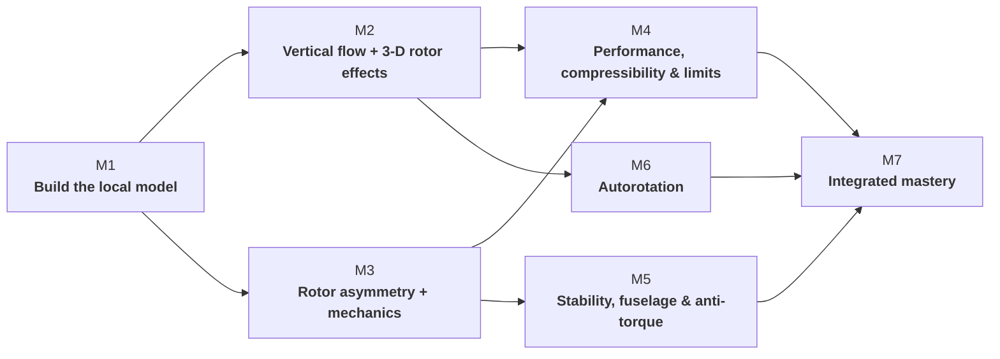

# Subject 082 — Learning Objective Mapping

## Purpose

This is the traceability layer between the Subject 082 knowledge spine and the 32-hour learning architecture. It is deliberately separate from the narrative handbook: the handbook explains the design; this page proves coverage and exposes gaps.

!!! warning "Working mapping"
    The LO codes and titles below are transcribed from the current project textbook cross-reference and must be verified against the currently applicable EASA source before the curriculum is frozen. Module allocation is a curriculum-design decision, not an EASA prescription.

## Coverage rule

An LO is not considered designed merely because a module letter appears beside it. Every LO ultimately needs:

**LO → concept / causal model → primary delivery location → activity or reference route → evidence / retrieval route**

For Module 1, this mapping now distinguishes three delivery roles so the four-hour pilot does not falsely claim to teach every prerequisite LO in contact time:

| M1 delivery role | Meaning |
|---|---|
| **CONTACT CORE** | explicitly built, practised and checked during the four-hour Module 1 session |
| **PRE-STUDY / REFERENCE** | required orientation/prerequisite knowledge delivered through approved source material and retrieval, not claimed as full contact teaching |
| **REASSIGNED PRIMARY** | substantive teaching belongs in a later module; Module 1 may only preview the connection |

This resolves the earlier overload in which Module 1 carried the largest nominal LO count despite the smallest contact allocation.

## Eight knowledge domains

| EASA domain | Primary curriculum home | Design note |
|---|---|---|
| **082 01 Subsonic Aerodynamics** | Modules 1–2, with later retrieval | M1 builds the 2-D/local force and BET foundation; 3-D/induced-flow depth continues in M2 |
| **082 02 Transonic Aerodynamics & Compressibility** | Module 4 | basic speed vocabulary may be referenced earlier; substantive Mach/compressibility teaching is M4 |
| **082 03 Rotorcraft Types** | Pre-study/reference + Modules 5/6 retrieval | orientation knowledge does not consume the M1 BET contact core |
| **082 04 Main-Rotor Aerodynamics** | Modules 1–4 & 6 | M1 establishes the first local blade-element/rotor model; flight-state depth spirals later |
| **082 05 Main-Rotor Mechanics** | Module 3 primarily | mechanics is taught where it explains rotor behaviour, not inserted into M1 as catalogue content |
| **082 06 Tail Rotors** | Module 5 | dedicated causal sequence including anti-torque |
| **082 07 Equilibrium, Stability & Control** | Module 5 | integrated forces, moments, CG and response |
| **082 08 Helicopter Flight Mechanics** | Modules 2, 4 & 7 | limits/performance become application and transfer problems |

---

# LO → primary delivery map

## 082 01 — Subsonic Aerodynamics

| LO | Title | Primary delivery | M1 role / note | Retrieval / transfer |
|---|---|---:|---|---|
| 082 01 01 00 | Basic concepts, laws and definitions | M1 | **CONTACT CORE umbrella** | all modules |
| 082 01 01 01 | SI units and conversion of units | M1 reference | **PRE-STUDY / REFERENCE**; diagnostic/retrieval as needed | quantitative activities |
| 082 01 01 02 | Definitions and basic concepts about air | M1 | **CONTACT CORE** to density/inertia depth needed for BET | M2, M4 |
| 082 01 01 03 | Newton's laws | M1 | **CONTACT CORE, bounded**; only explanatory depth required for local aerodynamic force | M2, M6 |
| 082 01 01 04 | Basic concepts of airflow | M1 | **CONTACT CORE** | all rotor modules |
| 082 01 02 00 | Two-dimensional airflow | M1 | **CONTACT CORE umbrella** | M3, M4, M6 |
| 082 01 02 01 | Aerofoil section geometry | M1 | **CONTACT CORE** | M4 |
| 082 01 02 02 | Aerodynamic forces on aerofoil elements | M1 | **CONTACT CORE** | M2–M6 |
| 082 01 02 03 | Stall | M1 | **CONTACT CORE, qualitative bridge**; mechanism/critical AOA, no universal αcrit | M2, M4 |
| 082 01 02 04 | Disturbances due to profile contamination | M4 | **REASSIGNED PRIMARY**; operational aerodynamic-limit context | M4 |
| 082 01 03 00 | Three-dimensional airflow around a blade | M2 | **REASSIGNED PRIMARY umbrella** | M3, M4 |
| 082 01 03 01 | The blade | M2 | **REASSIGNED PRIMARY**; M1 uses only local blade-element reference geometry | M3, M4 |
| 082 01 03 02 | Airflow pattern and influence on lift | M2 | **REASSIGNED PRIMARY** | M3, M4 |
| 082 01 03 03 | Induced drag | M2 | **REASSIGNED PRIMARY** | M4 |
| 082 01 03 04 | The airflow around a fuselage | M5 | **REASSIGNED PRIMARY**; best integrated with aircraft forces/stability | M4, M5 |

### M1 contact interpretation for 082 01

Module 1 therefore teaches the aerodynamic language needed to construct BET, not the entire 082 01 domain. The 3-D blade/fuselage and induced-drag payload is deliberately moved out of the four-hour pilot.

---

## 082 02 — Transonic Aerodynamics and Compressibility Effects

| LO | Title | Primary delivery | M1 role / note | Retrieval / transfer |
|---|---|---:|---|---|
| 082 02 01 00 | Airflow speeds and velocities | M4 | **REFERENCE ONLY in M1** where local velocity terminology is required; substantive speed/Mach framework in M4 | M3, M4 |
| 082 02 01 01 | Speeds and Mach number | M4 | **REASSIGNED PRIMARY** | M4 |
| 082 02 01 02 | Shock waves | M4 | outside M1 | — |
| 082 02 01 03 | Influence of aerofoil section and blade planform | M4 | M1 aerofoil geometry is prerequisite only | M4 |

This removes the earlier implication that Mach/compressibility foundations are a substantive four-hour M1 outcome.

---

## 082 03 — Rotorcraft Types

| LO | Title | Primary delivery | M1 role / note | Retrieval / transfer |
|---|---|---:|---|---|
| 082 03 01 01 | Rotorcraft types (autogyro vs. helicopter) | Pre-study/reference | **PRE-STUDY / REFERENCE** orientation | M6 |
| 082 03 02 01 | Helicopter configurations | Pre-study/reference | **PRE-STUDY / REFERENCE**; revisit with anti-torque/configuration consequences | M5 |
| 082 03 02 02 | The helicopter, characteristics and terminology | Pre-study/reference | **PRE-STUDY / REFERENCE** common vocabulary | all modules |

These LOs remain required knowledge, but they are not represented as hidden contact-time blocks inside M1. Their source/reference package and later retrieval must be explicit before course freeze.

---

## 082 04 — Main-Rotor Aerodynamics

| LO | Title | Primary delivery | M1 role / note | Retrieval / transfer |
|---|---|---:|---|---|
| 082 04 01 01 | Airflow through the rotor disc and around the blades | M1 → M2 spiral | **CONTACT CORE foundation**: local rotational + induced/axial velocity, vrel, φ, α; M2 develops full hover/vertical-flow state | M2–M6 |
| 082 04 01 02 | Anti-torque force and tail rotor | M5 | **REASSIGNED PRIMARY**; no claim of M1 contact coverage | M5 |
| 082 04 01 03 | Total power required and hover altitude OGE | M2 | outside M1 | M4 |
| 082 04 02 01 | Relative airflow and angles of attack in vertical climb | M2 | applies M1 BET model | M6 |
| 082 04 02 02 | Power and vertical speed in climb | M2 | outside M1 | M4 |
| 082 04 03 01 | Airflow and forces in uniform inflow distribution | M3 | uses M1/M2 foundation | M4 |
| 082 04 03 02 | The flare (powered flight) | M4 | outside M1 | M6 |
| 082 04 03 03 | Non-uniform inflow distribution and inflow roll | M3 | outside M1 | M4 |
| 082 04 03 04 | Power and maximum speed | M4 | outside M1 | M7 |
| 082 04 04 01 | Airflow in ground effect; downwash | M2 | outside M1 final evidence | operational transfer |
| 082 04 05 01 | Vertical descent, power on (incl. VRS) | M2 | outside M1 | M7 |
| 082 04 05 02 | Autorotation (vertical) | M6 | outside M1 | M7 |
| 082 04 06 01 | Airflow at the rotor disc in forward autorotation | M6 | outside M1 | M7 |
| 082 04 06 02 | Flight and landing in autorotation | M6 | outside M1 | M7 |

---

## 082 05 — Main-Rotor Mechanics

| LO | Title | Primary delivery | M1 role / note | Retrieval / transfer |
|---|---|---:|---|---|
| 082 05 01 01 | Forces and stresses on the blade | M3 | **REASSIGNED PRIMARY**; M1 teaches aerodynamic force vectors, not blade structural-stress coverage | M3, M4 |
| 082 05 01 02 | Centrifugal turning moment | M3 | **REASSIGNED PRIMARY** | M3 |
| 082 05 01 03 | Coning angle in hover | M2 | outside M1 | M3 |
| 082 05 02 01 | Forces on the blade in forward flight without cyclic feathering | M3 | outside M1 | M4 |
| 082 05 02 02 | Cyclic pitch in forward flight; advance angle and phase lag | M3 | outside M1 | M4 |
| 082 05 03 01 | Forces on the blade in the disc/tip-path plane in forward flight | M3 | outside M1 | M4 |
| 082 05 03 02 | Drag (lag) hinge and dampers | M3 | outside M1 | — |
| 082 05 03 03 | Ground resonance | M3 | outside M1 | M7 hazard comparison |
| 082 05 04 01 | See-saw / teetering rotor | M3 | outside M1 | — |
| 082 05 04 02 | Fully articulated rotor | M3 | outside M1 | — |
| 082 05 04 03 | Hingeless and bearingless rotors | M3 | outside M1 | H145 application |
| 082 05 05 01 | Blade sailing and its causes | M3 | outside M1 | M7 hazard comparison |
| 082 05 05 02 | Minimising the danger of blade sailing | M3 | outside M1 | M7 |
| 082 05 05 03 | Droop stops | M3 | outside M1 | — |
| 082 05 06 01 | Origins of vertical vibrations (main rotor) | M3 | outside M1 | M5 diagnosis |
| 082 05 06 02 | Lateral vibrations (main rotor) | M3 | outside M1 | M5 diagnosis |

---

## 082 06 — Tail Rotors

| LO | Title | Primary | Retrieval / transfer |
|---|---|---:|---|
| 082 06 01 01 | Tail-rotor description | M5 | — |
| 082 06 01 02 | Tail-rotor aerodynamics; drift; LTE | M5 | M7 |
| 082 06 01 03 | Strakes on the tail boom | M5 | — |
| 082 06 02 01 | Fenestron — technical layout | M5 | H145 application |
| 082 06 02 02 | Fenestron — control concepts | M5 | H145 application |
| 082 06 02 03 | Fenestron — advantages and disadvantages | M5 | configuration comparison |
| 082 06 03 01 | NOTAR — technical layout | M5 | configuration comparison |
| 082 06 03 02 | NOTAR — control concepts | M5 | configuration comparison |
| 082 06 03 03 | NOTAR — advantages and disadvantages | M5 | configuration comparison |
| 082 06 04 01 | Tail-rotor vibrations | M5 | diagnosis |
| 082 06 04 02 | Balancing and tracking | M5 | diagnosis |

---

## 082 07 — Equilibrium, Stability and Control

| LO | Title | Primary | Retrieval / transfer |
|---|---|---:|---|
| 082 07 01 01 | Equilibrium and attitudes in the hover | M2 | M5 |
| 082 07 01 02 | Equilibrium and attitudes in forward flight | M5 | M7 |
| 082 07 02 01 | Static longitudinal, roll and directional stability | M5 | M7 |
| 082 07 02 02 | Static stability in the hover | M5 | — |
| 082 07 02 03 | Dynamic stability | M5 | — |
| 082 07 02 04 | Longitudinal stability | M5 | M7 |
| 082 07 02 05 | Roll and directional stability; lateral-directional oscillations | M5 | M7 |
| 082 07 03 01 | Manoeuvre stability | M5 | M7 |
| 082 07 03 02 | Control power | M5 | M7 |
| 082 07 03 03 | Static and dynamic rollover | M2 | M7 |

---

## 082 08 — Helicopter Flight Mechanics

| LO | Title | Primary | Retrieval / transfer |
|---|---|---:|---|
| 082 08 01 01 | Flight limits — hover and vertical flight | M2 | M7 |
| 082 08 01 02 | Flight limits — forward flight; V-n diagram; VNE | M4 | M7 |
| 082 08 01 03 | Flight limits — manoeuvring | M4 | M7 |
| 082 08 02 01 | Operating with limited power | M4 | M7 |
| 082 08 02 02 | Overpitch and overtorque | M4 | M7 |

---

# Module 1 coverage summary after reconciliation

Module 1 no longer claims 20+ substantive contact LOs. Its **contact core** is the minimum set required to build and transfer the local BET model:

**air/relative-airflow foundations → 2-D blade geometry → local FL/FD/TAF → qualitative stall bridge → vrot = Ωr → induced/axial component → velocity triangle → φ → θ/α → local resolution → rotor consequence**.

Required orientation knowledge such as SI conversion, rotorcraft types/configurations and basic terminology is handled as **pre-study/reference with retrieval**. 3-D/induced-drag development moves primarily to M2; blade mechanics/stresses/CTM to M3; Mach/compressibility and contamination/limit context to M4; fuselage/anti-torque/tail-rotor integration to M5.

This allocation is a curriculum-design decision intended to make coverage auditable and the four-hour M1 pilot deliverable. It is not an EASA-prescribed module structure.

---

## What this mapping changes

The course is not organised by simply walking down the regulatory list. Foundational ideas are taught where they support a causal model and then deliberately retrieved in changed aerodynamic contexts. However, every regulatory LO must retain a visible primary delivery route; “spiral learning” is not permission for ambiguous coverage.

## Next traceability layer

The next data pass should add, per LO:

- reasoning level: **identify / describe / explain / predict / diagnose / transfer**;
- prerequisite concept(s);
- delivery vehicle: contact / pre-study / handbook / HeliLab / controlled assessment;
- HeliLab suitability and mission ID;
- primary evidence or retrieval route;
- source reference and verification status.

That enriched layer can then feed the handbook heat maps, machine-readable YAML and formal curriculum audit.
