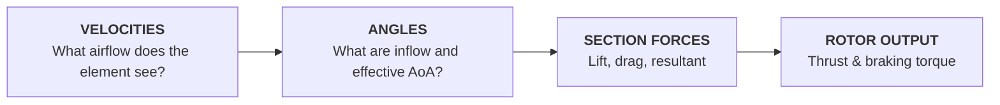
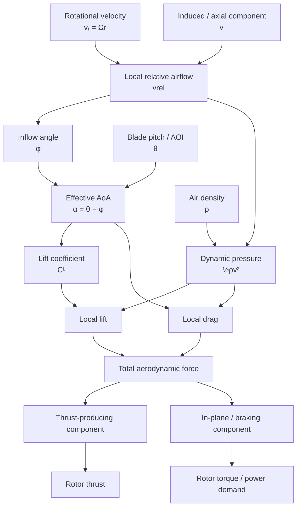
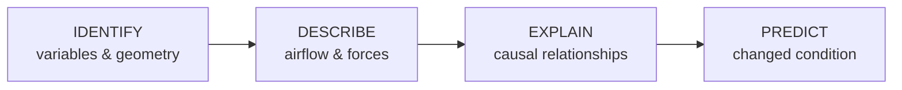

# Module 1 — Aerodynamic Foundations & Building Rotor Lift

## Mission

**Driving question:** *How can a rotating blade create and control rotor thrust?*

Module 1 builds the causal model that every later module reuses. The aim is not to complete a list of introductory definitions. The aim is for students to leave with a working blade-element model they can apply to hover, climb, descent, forward flight and autorotation.

> **Module end state:** Given a local blade condition, the student can reason from velocity inputs to relative airflow, inflow angle, effective angle of attack, local aerodynamic forces and finally whole-rotor thrust/torque consequences.

This is the recurring **BET reasoning chain** for the rest of the course.

---

## Why this module matters

Students often learn lift, drag, angle of attack and rotor terminology as separate facts. That creates a fragile mental model: it may be enough for a familiar multiple-choice question, but it is much less useful when a flight condition changes.

Module 1 therefore deliberately joins the Part I aerodynamic foundations to the Part II blade-element model. In the source textbook, Blade Element Theory is explicitly presented as the bridge between basic aerodynamics and rotor behaviour in hover, climb, descent and forward flight.

### Operational hook

> The helicopter is established in a stable hover. You raise collective. Before discussing what the aircraft does, can you explain what physically changes at one blade element — in the correct causal order?

The first answer is collected **before** the full model is taught. The same question returns at the end of the module.

---

## Learning architecture

| Stage | Student activity | Purpose | Evidence |
|---|---|---|---|
| **ORIENT** | Explain what must be true for a helicopter to remain in hover | Activate prior mental models | initial sketch / short explanation |
| **PREDICT** | Predict effect of increasing blade pitch while rotor speed is fixed | Force commitment before explanation | individual prediction |
| **BUILD 1** | Air, pressure, density, velocity, forces | Establish minimum aerodynamic language | rapid retrieval checks |
| **EXPLORE 1** | Change velocity / density / AoA in HeliLab | Make force dependencies visible | prediction vs observation |
| **BUILD 2** | Aerofoil geometry, lift, drag, stall | Build local section-force model | annotated blade-element diagram |
| **EXPLORE 2** | Cross critical AoA in controlled model | Distinguish stall mechanism from low-speed shorthand | explanation |
| **BUILD 3** | Rotational velocity, induced velocity, relative airflow, inflow angle | Assemble BET geometry | vector construction |
| **EXPLORE 3** | HeliLab blade-element mission | Connect input changes to local force and rotor output | mission response |
| **EXPLAIN** | Teach back the full causal chain | Make reasoning explicit | 60–90 s peer explanation |
| **APPLY** | Collective increase in hover + changed density condition | Transfer to unfamiliar condition | causal chain + decision |
| **CHECK & REFLECT** | Mixed retrieval / exam bridge | Test both regulatory knowledge and mental model | formative checkpoint |

---

## Four-hour lesson map

The timings are a design target, not a requirement to lecture continuously for the listed duration.

| Time | Learning block | Main focus |
|---:|---|---|
| 0:00–0:15 | **Orient + diagnostic prediction** | What keeps the helicopter in the air? What changes first when collective is raised? |
| 0:15–0:45 | **Aerodynamic language** | density, pressure, velocity, Newton, relative airflow |
| 0:45–1:15 | **Local aerofoil model** | chord, pitch/AOI, effective AoA, lift, drag, resultant force |
| 1:15–1:30 | **HeliLab Mission M1-01 / M1-02** | manipulate velocity, AoA and density |
| 1:30–1:40 | Retrieval break | no-notes sketch + peer correction |
| 1:40–2:10 | **Stall + real blade effects** | critical AoA, separation, 2D vs 3D blade |
| 2:10–2:40 | **Rotor velocity model** | rotational velocity, induced velocity, local relative airflow |
| 2:40–3:10 | **Blade Element Theory** | velocities → angles → forces → rotor outputs |
| 3:10–3:30 | **HeliLab Mission M1-04** | blade-element investigation |
| 3:30–3:50 | **Application challenge** | collective / density / rotor-speed changed conditions |
| 3:50–4:00 | **Check + exit explanation** | final causal chain and misconception check |

---

## Core model students must be able to reconstruct

Students do not need to reproduce every label from memory immediately. By the end of the module, however, they should be able to rebuild the *causal order* without prompts.

---

## HeliLab mission set

### M1-01 — What changes aerodynamic force?

**Mode:** Predict → Explore → Explain

Lock blade geometry. Allow controlled changes to local velocity and density.

Student task:

1. Predict which variable has the stronger qualitative effect on aerodynamic force.
2. Change one variable at a time.
3. Explain the observed relationship using dynamic pressure rather than memorised wording.

**Target misconception:** “More speed just means more lift” without recognising that drag also changes and that the force relationship is quadratic with velocity in the basic model.

### M1-02 — AoA is not pitch

Lock relative-airflow direction first, then allow blade pitch change. In the second state, hold blade pitch constant and change inflow direction.

**Required explanation:** angle of attack is the angle between chord line and **local relative airflow**, so AoA can change even if blade pitch does not.

### M1-03 — Cross the stall boundary

Student gradually increases effective AoA through the modelled critical region.

Before moving the control, they mark where they expect:

- lift to stop increasing normally;
- drag to rise strongly;
- the useful aerodynamic-force direction/magnitude to deteriorate.

The goal is conceptual, not to teach a universal numerical critical angle.

### M1-04 — Build a blade element

**Core mission of Module 1.**

The interface reveals the model in stages:

The student must commit to a prediction at stages 3, 4 and 6 before the answer layer is revealed.

### M1-05 — Rotor speed and blade loading

A short bridge into rotor mechanics. Students compare two rotor-speed states and reason qualitatively about rotational velocity and centrifugal loading. This mission prepares Module 3 rather than attempting to teach the complete mechanics block now.

---

## Misconceptions to deliberately expose

| Misconception | Instructor probe | Desired correction |
|---|---|---|
| “AoA is the same as blade pitch.” | Can AoA change while θ stays constant? | AoA depends on local relative-airflow direction |
| “Lift always acts vertically/upwards.” | Relative to what is lift defined? | Lift is perpendicular to local relative airflow |
| “Drag is always backwards relative to the helicopter.” | Backwards relative to what? | Drag is parallel and opposite to local relative airflow |
| “The blade tip and root see the same velocity.” | What happens to Ωr as r changes? | rotational velocity varies with radius |
| “One blade element's lift is rotor thrust.” | What must happen after local force is found? | forces must be resolved and summed over rotor |
| “Stall happens because speed is too low.” | What is the defining aerodynamic variable? | stall is fundamentally an AoA / separation condition |
| “Raising collective directly creates more thrust.” | What changes first at the blade? | pitch → AoA / force changes → integrated rotor effect |

---

## Assessment evidence

### Diagnostic

At module start:

> Draw one rotor blade element and show the airflow and force you believe keeps the helicopter in a hover.

This is **not graded**. It gives the instructor a misconception map.

### Formative checkpoint

Students receive three changed states:

**A.** same θ, increased induced velocity  
**B.** increased θ, same inflow  
**C.** same geometry, reduced density

For each state they must predict the direction of change through as much of the chain as can be justified.

### End-of-module evidence

A successful student can answer this without a memorised script:

> Rotor speed is constant and the pilot raises collective in hover. Trace the aerodynamic changes from the blade input to rotor thrust and torque. Then explain which parts of your answer would change if density were substantially lower.

Evidence is judged primarily on causal accuracy, not terminology perfection.

---

## Reasoning progression inside Module 1

**Diagnose** and **transfer** become dominant later; Module 1 creates the model needed to do them credibly.

---

## EASA coverage role

Module 1 is the primary instructional home for much of **082 01 Subsonic Aerodynamics**, the basic Mach/velocity foundation from **082 02**, orientation elements from **082 03**, the first main-rotor airflow model from **082 04**, and selected introductory blade-force/mechanics elements from **082 05**.

The detailed LO allocation remains in the dedicated LO mapping and machine-readable curriculum data. The important curriculum rule is that these LOs are **not finished after Module 1**: relative airflow, AoA, force resolution and BET are deliberately retrieved again in later flight regimes.

---

## Source-to-design traceability

This blueprint is built from the current project textbook, especially:

- the Subject 082 LO cross-reference;
- Chapters 2–5 for aerodynamic foundations;
- Chapter 7 for Blade Element Theory;
- Chapter 8 for initial rotor-force / motion concepts.

The source textbook defines BET as a local aerodynamic-force model using the sequence **local velocities → flow geometry/angles → section forces → summed rotor outputs**. The learning design above preserves that technical structure but adds prediction, guided manipulation, retrieval and transfer tasks.

---

## Design decisions to carry forward

!!! success "Decisions established by this prototype"
    **1. BET becomes the common reasoning language of the course.** Later modules should reuse the same diagram conventions rather than introduce independent explanatory systems.

    **2. Prediction is required before reveal in core HeliLab missions.** Pure slider exploration is not enough.

    **3. The lesson does not try to make every LO equally interactive.** HeliLab is used where dynamic relationships benefit from manipulation; terminology and configuration knowledge may use more efficient methods.

    **4. Every major diagram distinguishes local blade quantities from whole-rotor outputs.** This addresses a recurring conceptual confusion.

    **5. Module 1 ends with a transferable causal model, not merely an introductory knowledge test.**
