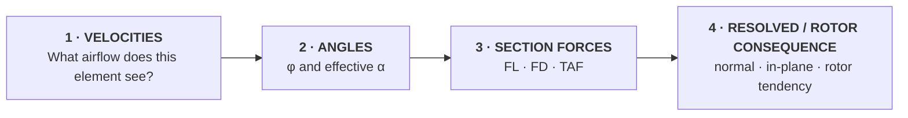

# Module 1 — Aerodynamic Foundations & Building Rotor Lift

> **You are here:** Curriculum architecture → **Module 1** → Build the core aerodynamic model

-   **DRIVING QUESTION**

    How can a rotating blade create and control rotor thrust?

-   **DURATION**

    **4.0 contact hours including protected breaks and transition buffer**

-   **REASONING TARGET**

    Identify → Describe → Explain → **Predict**

-   **MODULE END STATE**

    Given a new local blade condition, the student can reconstruct the aerodynamic model from velocity inputs rather than recall a completed diagram.

!!! info "Normative timing"
    This blueprint defines architecture, not minute-by-minute delivery. The current pilot timing is governed only by the **Module 1 Instructor Lesson Plan**. The pilot plans approximately **190 minutes of learning activity + 20 minutes protected breaks + 30 minutes distributed transition/setup/overrun buffer**.

## The module in one view

| Learning move | What the student actually does | Observable evidence |
|---|---|---|
| **CONCEPT** | Works with relative airflow, inflow, AOA, local aerodynamic force and rotor output | identifies variables in a blade-element state |
| **PREDICT** | Commits before reveal and gives a short reason at selected core gates | prediction + causal clause |
| **BUILD** | Constructs the blade-element model in causal order | rebuilds the velocity triangle without copying it |
| **EXPLORE** | Tests relationships in HeliLab | prediction compared with observed response |
| **EXPLAIN** | Explains input → geometry → force → output | causal explanation / peer teach-back |
| **APPLY** | Repairs the original collective problem using the completed model | original-vs-final annotation |
| **TRANSFER** | Constructs a fresh, unrehearsed blade-element state | independent exit construction |
| **RETRIEVE** | Reconstructs the model after delay and bridges to exam format | R1/R2 retrieval; formal assessment remains separate |

The module is a worked proof of the learning architecture. Exposure to a term is not evidence that the student can use it.

---

## The model students take forward

### Minimum reconstruction standard

By the end of Module 1 the student must be able to reconstruct:

**local velocity inputs → relative airflow → inflow angle → effective AOA → lift/drag → resultant force → resolved components → rotor consequence**

For the pilot, the local in-plane/braking component is introduced qualitatively as part of force resolution. Quantitative torque/power development belongs later.

A student who can reproduce **α = θ − φ** but cannot construct the velocity triangle has **not** met the Module 1 end state.

---

## Worked learning journey

### PREDICT — commit before explanation

> A helicopter is established in a stable hover. Rotor speed remains constant. The pilot raises collective. At one blade element, what changes first — and what happens next?

Students sketch before the full model is shown. At selected core gates, a direction-only answer is insufficient: the student also states the causal reason.

### BUILD — geometry before formula

The model is constructed in four passes:

1. **Local velocity inputs** — rotational velocity **vrot = Ωr** plus induced/axial component.
2. **Flow geometry** — construct **vrel** and obtain inflow angle **φ** from the velocity triangle.
3. **Blade geometry and forces** — position blade pitch **θ**, determine effective **α**, then orient FL and FD and form TAF.
4. **Resolved consequence** — resolve the local aerodynamic force and distinguish local element output from whole-rotor output.

Only after the geometry is constructed is **α = θ − φ** named. The equation is a summary of the geometry, not a shortcut around it.

### EXPLORE — HeliLab as a thinking tool

| Mission | Mode | Purpose |
|---|---|---|
| **M1-01 Force dependency** | Model | inspect airflow/density dependency where available |
| **M1-02 AOA ≠ pitch** | Explore | separate blade pitch from effective AOA |
| **M1-03 Stall boundary** | Explore | brief qualitative mechanism check |
| **M1-04 Build a blade element** | Mission | guided construct → predict → reveal |

M1-04 is deliberately not the formal Module 1 assessment. HeliLab supports learning and formative thinking; it is not the pilot system of record.

### EXPLAIN — make causal reasoning visible

Peer teach-back remains a learning activity. It is **not** treated as stored per-student rubric evidence. A strong explanation connects:

**input → relative airflow → inflow geometry → effective AOA → local force → resolved consequence**.

### APPLY — repair the original model

Students return to their original collective prediction and annotate it rather than write a clean replacement. This preserves visible conceptual change.

### TRANSFER — unrehearsed construction

The primary end-of-module transfer snapshot is a **new blade-element state not used in the worked examples or canonical M1-04 mission**. The student receives the reference plane, vrot, an axial/induced component and θ, but no vrel, φ, α or force vectors.

The student must construct the velocity triangle, obtain φ, determine α, orient FL/FD, resolve the qualitative local consequence and explain the rotor tendency. The highest formative level cannot be awarded if the velocity triangle is absent or geometrically incoherent, even if the final tendency is correct by chance.

### RETRIEVE — retention and exam bridge

Delayed retrieval is part of the design. Exam-format bridging belongs in the retrieval/formal-assessment layer rather than consuming the four contact hours. Public curriculum documentation should use authored prototype items or describe the assessment route; licensed or sensitive question-bank material must not be published here.

---

## Misconceptions designed into the lesson

| Misconception | Probe | Required conceptual correction |
|---|---|---|
| **AOA = blade pitch** | Can α change while θ stays constant? | AOA depends on local relative airflow |
| **Lift acts upward** | Change the airflow direction and ask again | lift is perpendicular to local relative airflow |
| **Drag points aft** | What is the adopted relative-flow reference? | drag direction follows the declared local airflow convention |
| **Tip and root see the same speed** | What happens to Ωr as r changes? | rotational velocity varies with radius |
| **Local lift = rotor thrust** | What still has to happen? | resolve local force, then sum elements |
| **Low speed causes stall** | What defines the stall condition? | critical AOA / separation, not speed alone |
| **Collective directly makes thrust** | What changes at the blade first? | pitch is an input; rotor force is downstream |
| **φ changes because the formula says so** | Remove the equation | construct the velocity triangle |

---

## Module 1 scope contract

A four-hour contact module cannot honestly be the full instructional home for every regulatory LO that depends on aerodynamic foundations. Module 1 therefore distinguishes three roles:

| Role | Meaning |
|---|---|
| **CONTACT CORE** | explicitly built, practised and checked during the four-hour session |
| **PRE-STUDY / REFERENCE FOUNDATION** | required orientation or prerequisite knowledge, available in approved source material but not claimed as fully taught in contact time |
| **REASSIGNED PRIMARY** | regulatory content whose substantive teaching belongs in a later module and is only previewed here if useful |

### Contact core

The contact core is deliberately narrow: relative airflow and dynamic-pressure foundations; aerofoil/chord/θ/α; lift/drag/TAF orientation; qualitative stall mechanism; **vrot = Ωr**; velocity-triangle construction; φ and α from geometry; local force resolution; local-versus-rotor distinction; and the complete qualitative BET causal chain.

### Reassigned or deferred depth

Detailed 3-D blade-flow effects, induced-drag development, fuselage airflow, compressibility/Mach operational limits, rotorcraft-configuration depth, anti-torque/tail-rotor aerodynamics, blade stresses/centrifugal turning moment, hover power, complete flapping/lead-lag mechanics, VRS, retreating-blade stall, autorotation and full stability/control are not claimed as four-hour Module 1 contact outcomes. Their primary homes are defined in the LO map and later module designs.

---

## HeliLab evidence boundary

For the initial pilot:

- HeliLab is a **learning and formative-thinking tool**, not the formal evidence store;
- structured prediction gates may be required before reveal;
- session-state feedback is sufficient;
- no LMS persistence, instructor dashboard or natural-language scoring is required;
- HeliLab's existing progress/mastery tracker is a **student-facing self-study/progress mechanism**, not the curriculum's 0–3 evidence model;
- formal controlled assessment remains outside HeliLab unless a later architecture decision changes this.

---

## Pilot evidence strategy

The strongest pilot evidence is intentionally simple:

- original prediction sheet and final annotation;
- independent velocity-triangle construction checks;
- unrehearsed transfer/exit artefact;
- delayed retrieval;
- instructor pilot observations tied to collected artefacts where practical.

Peer teach-back is valuable learning but is not counted as stored assessment evidence. Confidence ratings remain reflective only.

---

## Design decisions established here

!!! success "Module 1 design standard"
    **1. BET is the common reasoning language.** Later modules reuse the same causal model.

    **2. Prediction precedes reveal, but core predictions require reasoning rather than one-bit guessing.**

    **3. Geometry precedes α = θ − φ.** The velocity triangle is the master construction.

    **4. HeliLab has a bounded role.** It supports thinking; it does not become a parallel formal assessment architecture.

    **5. Local blade quantities and whole-rotor outputs are visually separated.**

    **6. The module ends with unrehearsed construction/transfer, not a repeated practice item.**

    **7. The Instructor Lesson Plan is the single normative pilot timeline.**

---

## Source-to-design note

The technical spine — local velocities, relative airflow, inflow geometry, effective AOA, section forces and resolved rotor consequence — is derived from the approved project source material. Prediction-before-reveal, the contact/pre-study/reassigned scope model, peer explanation, unrehearsed transfer, HeliLab evidence boundary and pilot instrumentation are instructional-design decisions and must be validated in delivery.
