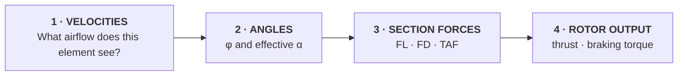
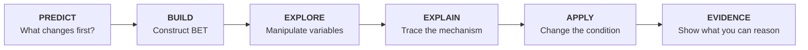
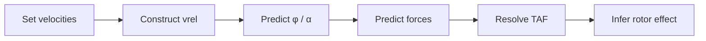

# Module 1 — Aerodynamic Foundations & Building Rotor Lift

> **You are here:** Curriculum architecture → **Module 1** → Build the core aerodynamic model

-   **DRIVING QUESTION**

    How can a rotating blade create and control rotor thrust?

-   **DURATION**

    **4.0 hours** — foundation module

-   **REASONING TARGET**

    Identify → Describe → Explain → **Predict**

-   **MODULE END STATE**

    Given a local blade condition, the student can reason from airflow inputs to rotor thrust and torque consequences.

## The module in one view

| Learning move | What the student actually does | Observable evidence |
|---|---|---|
| **CONCEPT** | Works with relative airflow, inflow, AoA, local aerodynamic force and rotor output | Correctly identifies the variables in a blade-element state |
| **LOs** | Connects aerodynamic foundations to the first rotor model | LO coverage is traceable in the Subject 082 mapping |
| **PREDICT** | Commits to what changes when pitch, airflow, density or rotor speed changes | Prediction recorded before reveal |
| **BUILD** | Constructs the blade-element model in causal order | Rebuilds the diagram without copying it |
| **EXPLORE** | Changes one or two variables in HeliLab | Prediction compared with observed model response |
| **EXPLAIN** | Explains the mechanism from input to force/output | 60–90 second causal explanation |
| **APPLY** | Reuses the model in a changed hover/density condition | Correct direction of change with justification |
| **EVIDENCE** | Completes mixed diagram, explanation and exam-bridge checks | Causal accuracy rather than answer recognition alone |

This page is the first **worked proof** of the learning architecture. The labels above only matter if they lead to observable student behaviour.

---

## The model students take forward

The source textbook treats Blade Element Theory as a qualitative causal model that connects basic aerodynamics to rotor behaviour. Its technical sequence is preserved here:

**The course keeps returning to this chain.** Hover, climb, descent, forward flight and autorotation change the inputs and boundary conditions; students should not need a completely new explanatory language each time.

### Minimum reconstruction standard

By the end of Module 1 a student should be able to reconstruct, in words or as a sketch:

**local velocity inputs → relative airflow → inflow angle → effective AoA → lift/drag → resultant force → resolved components → rotor thrust/torque**

The student does not need every symbol perfectly from memory on first exposure. The **causal order** must become stable.

---

## Worked learning journey

### PREDICT — commit before explanation

**Prompt**

> A helicopter is established in a stable hover. Rotor speed remains constant. The pilot raises collective. At one blade element, what changes first — and what happens next?

Students make an individual prediction before the full model is shown. A sketch is preferable to selecting an answer.

**Why:** this exposes whether the student currently treats collective as a direct “more thrust” control or can already reason through blade pitch, local AoA and force.

### BUILD — construct rather than receive the model

The instructor builds the model in four passes:

1. **Local velocity inputs** — rotational velocity and axial/induced components form local relative airflow.
2. **Flow geometry** — relative airflow establishes inflow angle; effective AoA depends on blade pitch relative to that airflow.
3. **Section forces** — local lift and drag produce a total aerodynamic force.
4. **Rotor consequence** — force components are resolved and summed into thrust and braking torque.

The textbook's compact relation **AOA = AOI − INFLOW (α = θ − φ)** is used as a reasoning relation, not merely as a formula to recall.

### EXPLORE — test the model in HeliLab

HeliLab is used only where manipulating the relationship adds learning value. Module 1 uses four progressive interactions:

| Mission | Mode | Student manipulation | Required evidence |
|---|---|---|---|
| **M1-01 Force dependency** | Model | velocity / density | identify what changes and why |
| **M1-02 AoA ≠ pitch** | Explore | pitch and inflow separately | explain how AoA changes with θ fixed |
| **M1-03 Stall boundary** | Explore | effective AoA | predict before crossing the modelled boundary |
| **M1-04 Build a blade element** | Mission | local velocity + pitch state | complete the full BET causal chain |

#### M1-04 — core mission

The answer layer is withheld at the key prediction points. **Moving sliders without committing to a prediction is not completion.**

### EXPLAIN — make causal reasoning visible

Students explain the core mission to a peer or instructor in approximately 60–90 seconds. The explanation must connect cause to consequence rather than list definitions.

A strong response sounds structurally like:

> *This input changes the local relative airflow... therefore the inflow geometry changes... that changes effective AoA... which changes the local aerodynamic force... and after resolving/summing the force the rotor consequence is...*

The wording may vary. The causal links may not.

### APPLY — change one condition

Return to the opening hover problem, then change the environment:

> Rotor speed remains constant and collective is raised in hover. Now repeat your reasoning for substantially lower air density. Which links in your original explanation remain the same, and where does density enter the model?

This is deliberately close enough to reuse the model but different enough that a memorised opening answer is insufficient.

### EVIDENCE — show mastery, not exposure

The formative checkpoint uses three states:

| State | Changed condition | Student must show |
|---|---|---|
| **A** | same θ, increased induced velocity | effect on inflow → AoA → force tendency |
| **B** | increased θ, same inflow | effect on AoA → local force → rotor output |
| **C** | same geometry, reduced density | where density enters and what follows |

The student then answers the original hover question again. The comparison between the first and final explanation makes conceptual change visible.

---

## Four-hour learning timeline

The split timeline is intentional: overview diagrams remain readable at normal desktop width.

---

## Misconceptions designed into the lesson

| Misconception | Probe | Required conceptual correction |
|---|---|---|
| **AoA = blade pitch** | Can α change while θ stays constant? | AoA depends on local relative airflow |
| **Lift acts upward** | Upward relative to what? | Lift is perpendicular to local relative airflow |
| **Drag points aft** | Aft relative to what? | Drag opposes local relative airflow |
| **Tip and root see the same speed** | What happens to Ωr as r changes? | rotational velocity varies with radius |
| **Local lift = rotor thrust** | What still has to happen? | resolve and sum local forces |
| **Low speed causes stall** | What defines the stall condition? | critical AoA / separation, not speed alone |
| **Collective directly makes thrust** | What changes at the blade first? | pitch is the input; rotor force is downstream |

These are not side notes. They determine where prediction and explanation are placed.

---

## LO → learning → evidence traceability

Module 1 is the primary instructional home for much of **082 01 Subsonic Aerodynamics**, selected velocity/compressibility foundations from **082 02**, rotorcraft orientation from **082 03**, the first main-rotor airflow model from **082 04**, and selected introductory mechanics from **082 05**.

| LO family | Learning function here | Evidence route | Later retrieval |
|---|---|---|---|
| **082 01** | aerodynamic language + local force model | sketch, retrieval, changed-condition explanation | all later rotor modules |
| **082 02** | velocity/Mach foundation | identify and explain speed relationship | forward-flight limits |
| **082 03** | helicopter/rotor orientation | configuration recognition in context | tail-rotor/configuration work |
| **082 04** | first rotor airflow / thrust model | BET mission + hover application | hover, forward flight, autorotation |
| **082 05** | local blade forces / rotor-speed bridge | qualitative force reasoning | rotor motion and mechanics |

The detailed individual LO allocation remains in the dedicated **EASA LO Mapping**. An LO is not considered “done” because it appeared in this module; foundational concepts are deliberately retrieved in later flight regimes.

---

## HeliLab role established by this module

Module 1 also establishes the progressive HeliLab scaffolding that later modules will reuse:

**Model** makes relationships visible. **Explore** lets students test one or two variables. **Mission** requires prediction and causal explanation. **Challenge** removes scaffolding and introduces transfer; it becomes more prominent in later modules.

---

## Design decisions proven or tested here

!!! success "Module 1 design standard"
    **1. BET is the common reasoning language.** Later modules reuse the same visual and causal conventions.

    **2. Prediction precedes reveal.** HeliLab interaction is not treated as evidence unless the student has committed to an expectation where appropriate.

    **3. HeliLab has a bounded role.** Dynamic relationships are manipulated; terminology is not made interactive merely for novelty.

    **4. Local blade quantities and whole-rotor outputs are visually separated.**

    **5. The module ends with transfer of a causal model, not completion of an introductory fact list.**

    **6. Evidence is designed with the learning activity.** It is not added as a quiz after the lesson has already been designed.

---

## Source-to-design note

This worked module preserves the technical organisation of the current project textbook: aerodynamic foundations feed into Blade Element Theory, and BET connects local velocities, flow geometry, section forces and rotor outputs. The source also explicitly positions BET as a qualitative model for predicting rotor behaviour across hover, climb, descent and forward flight. The learning-design additions on this page — prediction-before-reveal, HeliLab scaffolding, peer explanation, changed-condition application and evidence design — are curriculum design choices layered onto that technical source structure.
