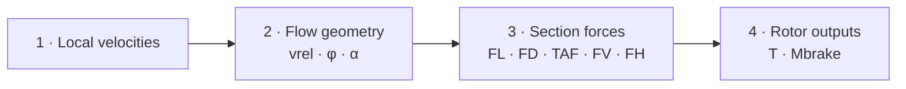
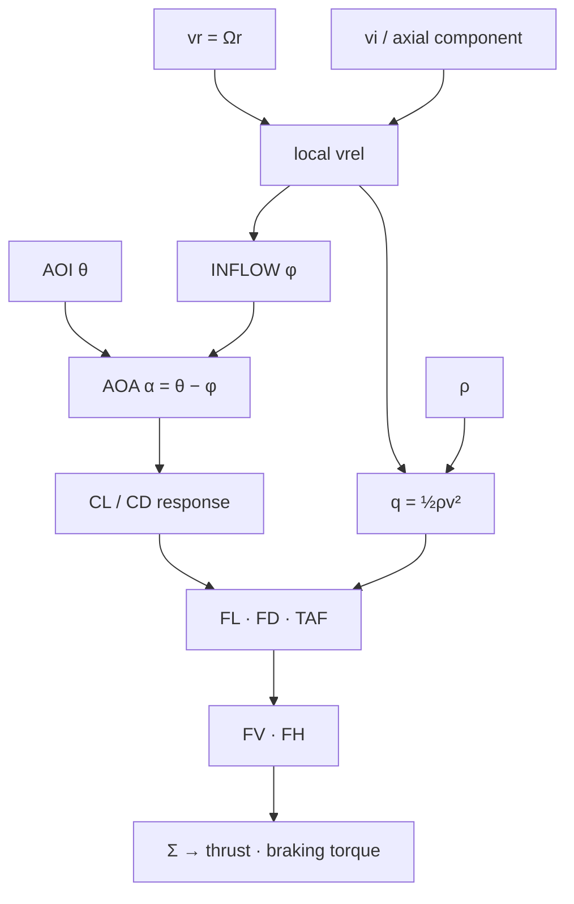

# Module 1 — Complete Learning Experience

> **You are here:** Subject 082 → Module 1 → complete learning experience prototype

This page turns the Module 1 blueprint into a **deliverable learning journey**. It specifies what happens before class, during the four contact hours, in HeliLab, after class, and what evidence shows that the student has built a usable aerodynamic model.

!!! info "Prototype status"
    **Design prototype — in review.** Technical content is grounded in the current project textbook. Timing, media format, HeliLab implementation and assessment thresholds are curriculum-design decisions to be validated in delivery.

## 1 · Learning contract

**Driving question:** *How can a rotating blade create and control rotor thrust?*

**End-of-module performance:** Given a local blade condition or a simple changed flight condition, the student can reconstruct the chain:

**velocity inputs → relative airflow → INFLOW / AOA → local forces → resolved force → rotor thrust / braking torque**

The student must be able to **predict a direction of change and explain why**, not only recognise terminology.

### Technical anchor

The source textbook defines BET as a local aerodynamic-force model: determine each blade element and then sum across elements and blades. The reference analysis procedure is:

Key relation used throughout the module:

**AOA = AOI − INFLOW   ⇔   α = θ − φ**

---

# BEFORE CLASS · Prepare the model

**Target student time: 15–20 min**

The purpose is not to teach Module 1 before the lesson. It gives students enough language to make the opening prediction meaningful.

## Student package

### A · Micro-overview — 6–8 min

**Working title:** *From one blade element to rotor thrust*

Recommended media format: controlled narrated visual or NotebookLM Video Overview generated only from the approved Module 1 source pack.

The media should introduce, without completing the later reasoning task:

1. air has mass and inertia;
2. aerodynamic force depends on local airflow and density;
3. lift and drag are defined relative to local relative airflow;
4. AOA is not the same quantity as blade pitch/AOI;
5. a rotor is understood by examining local blade elements and then summing their effects.

**Do not reveal the complete collective-raised answer.** That remains the opening prediction problem.

### B · Three retrieval/preparation prompts

1. Draw an aerofoil and label **chord line**, **relative airflow**, **AOI/pitch** and **AOA**.
2. If local relative-airflow speed doubles while all other terms in the basic force model remain unchanged, what happens to dynamic pressure?
3. Is lift defined as “upwards”? Give a one-sentence answer.

These are preparation checks, not marks.

### C · Confidence check

Students mark 1–5:

> *I can explain how changing one blade input eventually changes rotor thrust.*

The same item returns after the module. It is reflective evidence, not mastery evidence.

---

# CONTACT HOUR 1 · Expose and build the local model

## 00:00–00:15 · ORIENT + PREDICT

### Operational hook

> A helicopter is established in a stable hover. Rotor speed remains constant. The pilot raises collective. At one blade element, **what changes first, and what happens next?**

### Student output

Individually, without notes:

- draw one blade section;
- draw the airflow they believe matters;
- identify the first quantity that changes;
- continue the causal chain as far as they can.

**Instructor rule:** collect or freeze the prediction before explanation. Do not correct it yet.

### Diagnostic coding

The instructor quickly looks for four patterns:

| Code | Student model | Teaching implication |
|---|---|---|
| **D1** | collective → thrust directly | needs intermediate blade-element chain |
| **D2** | AOI/pitch = AOA | needs airflow-relative angle distinction |
| **D3** | lift = vertical / drag = aft | needs force-reference correction |
| **D4** | local lift = rotor thrust | needs resolve + sum distinction |

No score is assigned.

## 00:15–00:45 · BUILD 1 — aerodynamic language

Teach only the concepts required to support the later rotor model:

- air density and inertia;
- relative motion / relative airflow;
- dynamic pressure **q = ½ρv²**;
- Newton/reaction and pressure-field views as complementary explanations;
- local versus aircraft-level reference frames.

### Mini-prediction

> Two otherwise identical blade elements see 50 m/s and 100 m/s local relative airflow. Ignore changes in coefficients. Is aerodynamic force approximately ×2 or ×4?

Students commit first, then use the dynamic-pressure relation.

## 00:45–01:15 · BUILD 2 — aerofoil, AOA and forces

Build one clean common diagram containing:

- chord line;
- relative airflow;
- AOI / pitch angle θ;
- effective AOA α;
- FL perpendicular to vrel;
- FD parallel/opposite vrel;
- TAF as resultant.

### Critical distinction

> **AOA belongs to the relationship between the blade chord and local relative airflow. It is not simply the blade's mechanical pitch angle.**

### Stall bridge

Introduce the source model only to the depth needed here:

**α ↑ → CL ↑ approximately pre-stall**  
**α > αcrit → separation → CL ↓ and drag ↑**

The module avoids teaching a universal critical-AOA number; the source explicitly treats it as profile/Reynolds dependent.

## 01:15–01:30 · HELILAB — Model / Explore

### M1-01 · Force dependency — MODEL

**Controls:** local velocity, density.  
**Locked:** geometry/AOA.

Student sees labelled force vectors and graph response.

**Prompt:** *Predict before moving the control: which variable has the stronger mathematical relationship with force?*

### M1-02 · AOA ≠ pitch — EXPLORE

State A: change θ while relative-airflow direction is fixed.  
State B: hold θ fixed and change inflow direction.

**Required response:** explain why α changes in both cases.

---

# CONTACT HOUR 2 · Build the rotor airflow geometry

## 01:30–01:40 · RETRIEVAL BREAK

No notes. Students redraw the local aerofoil diagram and compare with a partner. Corrections are made in a different pen/annotation state so misconceptions remain visible.

## 01:40–02:10 · BUILD 3 — stall and real blade effects

Use the AOA–CL relationship to distinguish:

- low speed from stall mechanism;
- laminar/turbulent transition from separation;
- profile behaviour from the later whole-rotor consequence.

### M1-03 · Stall boundary — EXPLORE

Before increasing effective AOA, student predicts where the qualitative response changes. HeliLab then reveals lift/drag behaviour through the modelled stall region.

**Evidence:** one causal sentence, not a slider endpoint.

## 02:10–02:40 · BUILD 4 — from rotating blade to local relative airflow

Introduce the minimum BET velocity model:

- rotational velocity **vr = Ωr**;
- induced velocity **vi**;
- vector combination → **vrel**;
- inflow angle **φ**;
- effective AOA **α = θ − φ**.

### Radial thought experiment

> At the same Ω, does a blade element near the root or near the tip have the greater rotational velocity? What does that imply for local dynamic pressure if other terms are held constant?

This is the first explicit bridge from 2D aerofoil knowledge to a rotating blade.

---

# CONTACT HOUR 3 · Assemble Blade Element Theory

## 02:40–03:10 · BUILD 5 — complete BET chain

The instructor now assembles the full model from pieces students have already used.

### Instructor narration rule

Always speak in causal connectors:

**because → therefore → which changes → so the consequence is...**

Avoid turning the diagram into a vocabulary tour.

## 03:10–03:30 · HELILAB M1-04 — Build a blade element — MISSION

This is the core evidence-producing HeliLab interaction.

### Mission state

The student receives a local blade element with specified/visualised:

- radius;
- rotor speed;
- induced/axial flow;
- blade AOI.

### Progressive task

1. identify the velocity inputs;
2. construct or predict local vrel;
3. identify/predict φ;
4. determine the effect on α;
5. predict FL/FD tendency;
6. resolve the aerodynamic consequence qualitatively;
7. infer the rotor thrust/torque tendency.

### Prediction gates

At steps **3, 5 and 7**, the student must commit before the model reveals the response.

### Mission completion evidence

Completion requires both:

- correct final direction/tendency; and
- a causal explanation containing the essential intermediate links.

A correct endpoint reached by uncontrolled slider searching is **not** sufficient evidence.

---

# CONTACT HOUR 4 · Explain, transfer and evidence

## 03:30–03:40 · EXPLAIN — peer teach-back

Pairs alternate roles: pilot/student and reviewer.

**Prompt:**

> Explain M1-04 from input to rotor consequence in 60–90 seconds without using the diagram.

Reviewer listens for:

- correct reference airflow;
- distinction θ / α;
- local force before rotor output;
- no missing causal jump from collective directly to thrust.

## 03:40–03:50 · APPLY — changed condition

Return to the opening problem:

> Rotor speed is constant. Collective is raised in hover. Trace the aerodynamic chain.

Then add:

> The same helicopter now operates at substantially lower air density. Which links in your explanation remain unchanged? Where does density enter, and what tendency follows if geometry and local speed were otherwise unchanged?

Students annotate their **original 00:00 prediction** rather than starting on a blank sheet. This makes conceptual change visible.

## 03:50–04:00 · CHECK & REFLECT

### Exit item 1 — diagram reconstruction

From a blank blade section, add the minimum geometry/force information needed to explain BET.

### Exit item 2 — changed state

> θ is unchanged but induced velocity increases. Predict the initial effect on φ and α and justify the direction of change.

### Exit item 3 — misconception discriminator

> A student says: “The blade stalled because its airspeed became too low.” What is incomplete or wrong about this statement?

### Confidence re-rate

Repeat the 1–5 confidence item from pre-study and add:

> *What can you now explain that you could not explain before the lesson?*

---

# AFTER CLASS · Consolidate and retrieve

## Within 24 hours · 10–15 min

### Controlled recap media

Recommended: NotebookLM Audio Overview or short video recap using the approved source pack plus the final Module 1 learning summary.

**Prompting intent:** recap the BET causal chain, explicitly contrast the main misconceptions, and preview that later modules will change the velocity inputs rather than replace the model.

This media is **consolidation, not authoritative source material**. The approved textbook/handbook remains the technical source.

### Retrieval set R1

Students answer without notes first:

1. Write the BET chain in four blocks.
2. Explain **α = θ − φ** in words.
3. Why can a change in inflow alter AOA without a pitch change?
4. Why is local lift not the same as rotor thrust?
5. If vrel increases while ρ and coefficients remain fixed, which term in the force relation makes the response nonlinear?

## 3–7 days later · spaced retrieval R2

Three short changed-condition questions are inserted into Link & Learn / the next lesson:

- same θ, increased axial flow;
- same Ω, compare root and outboard element;
- identify the flaw in a “stall = low airspeed” explanation.

The goal is **retrieval of the model after delay**, not rereading.

---

# Evidence model

A module is not considered complete merely because content was delivered.

| Evidence | When | What it demonstrates | Stored? |
|---|---|---|---|
| Initial blade sketch | start | prior mental model / misconception | optional diagnostic |
| Prediction gates | HeliLab | commitment before feedback | yes, if platform supports it |
| BET mission explanation | hour 3 | causal reasoning | yes / rubric result |
| Original-vs-final annotation | hour 4 | conceptual change | recommended |
| Exit items | end | immediate reconstruction/transfer | yes |
| R1 / R2 retrieval | after | retention and delayed transfer | yes |
| Formal LPlus item(s) | later | exam-format bridge | according to assessment plan |

## Lightweight explanation rubric

| Level | Description |
|---|---|
| **0 · Recognition only** | identifies terms but cannot connect them |
| **1 · Partial chain** | some correct links, major causal jump remains |
| **2 · Coherent model** | correct velocities → angles → forces → rotor-output chain |
| **3 · Transfer** | coherent chain remains correct when a relevant condition changes |

This rubric is formative in Module 1. Formal pass/fail thresholds are not set here.

---

# HeliLab implementation brief for Module 1

## Progressive modes

**MODEL → EXPLORE → MISSION → CHALLENGE**

Module 1 uses Model, Explore and Mission heavily. A short Challenge can be offered to advanced students, but Challenge becomes more important later in the course.

### Interface rules

- one main conceptual question per screen/state;
- labels can be progressively hidden;
- prediction must precede reveal at designated gates;
- change no more than one or two independent variables in early Explore tasks;
- display local blade quantities separately from whole-rotor outputs;
- show **what changed** after an action, not merely the final number;
- allow reset to the reference state;
- feedback explains the causal link, not just “correct/incorrect”.

### M1 mission inventory

| ID | Name | Mode | Priority | Build status |
|---|---|---|---|---|
| M1-01 | Force dependency | Model | High | specification |
| M1-02 | AOA ≠ pitch | Explore | Critical | specification |
| M1-03 | Cross the stall boundary | Explore | Medium | specification |
| M1-04 | Build a blade element | Mission | **Critical** | specification |
| M1-05 | Rotor-speed / radial bridge | Challenge/bridge | Low | optional |

---

# Media/source pack specification

For any NotebookLM or generated media, use a **curated Module 1 source pack**, not the entire project library indiscriminately.

Recommended approved inputs:

1. selected textbook sections on Properties of Air;
2. Lift / AOA / stall sections;
3. Blade Element Theory chapter and exercises;
4. final Module 1 handbook summary;
5. approved terminology/convention sheet.

Generated media should be reviewed for:

- θ / α / φ distinction;
- lift/drag reference directions;
- local versus whole-rotor force distinction;
- correct use of qualitative BET;
- no invented universal critical-AOA value;
- no premature forward-flight rules that belong to later modules.

---

# What deliberately does NOT belong in Module 1

To protect cognitive load and preserve later learning problems, Module 1 should not attempt to fully teach:

- detailed hover momentum/power performance;
- complete flapping/lead-lag rotor mechanics;
- dissymmetry of lift as a full forward-flight lesson;
- retreating-blade stall operational detail;
- VRS;
- autorotation regions;
- detailed compressibility limits;
- complete stability/control behaviour.

They may be **previewed as future applications of the same model**, but their full causal chains belong later.

---

# Definition of done — Module 1 prototype

Module 1 is ready for pilot delivery when:

- [ ] approved pre-study source pack exists;
- [ ] 6–8 minute pre-study media is reviewed;
- [ ] instructor visual sequence is produced;
- [ ] opening/final prediction sheet is produced;
- [ ] HeliLab M1-01, M1-02 and M1-04 are implemented;
- [ ] explanation rubric is tested with sample responses;
- [ ] exit items and R1/R2 retrieval are loaded;
- [ ] LO coverage is verified against the authoritative current EASA source;
- [ ] one instructor can run the module from the lesson guide;
- [ ] one reviewer can trace each major activity to intended evidence.

!!! success "Design principle established"
    **The four contact hours are not the module.** The module is the complete sequence **prepare → predict → build → explore → explain → apply → retrieve**, with the classroom, HeliLab, handbook, media and assessment each assigned a bounded learning function.
