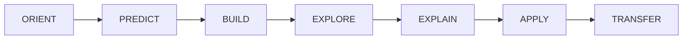

# Module 1 — Complete Learning Experience

> **You are here:** Subject 082 → Module 1 → complete learning experience prototype

This page defines the student journey before, during and after Module 1. It intentionally does not duplicate minute-by-minute timing. The **Module 1 Instructor Lesson Plan is the single normative pilot timeline**.

!!! info "Prototype status"
    Technical content is grounded in the current project source material. Timing, media, HeliLab use and evidence design are instructional-design decisions to validate in the pilot.

## Learning contract

**Driving question:** *How can a rotating blade create and control rotor thrust?*

**End performance:** given a new local blade condition, independently reconstruct:

**velocity inputs → relative airflow → INFLOW / AOA → local forces → resolved components → rotor consequence**

A direction-of-change answer alone is insufficient. The student must construct the geometry and explain the causal chain. **α = θ − φ** is introduced only after φ has been constructed from the velocity geometry.

---

# BEFORE CLASS · Prepare without pre-answering

**Target: 15–20 min.** Pre-study orients and checks prerequisites; it must not teach the later prediction gates in advance.

### Micro-overview

Introduce air mass/inertia and density, local relative airflow, lift/drag relative to that airflow, the distinction between blade pitch and AOA, and the idea of examining a local blade element. **Do not** show the completed BET velocity triangle, derive α = θ − φ, or reveal the full collective-raised causal chain.

### Preparation prompts

1. On a simple aerofoil sketch, identify chord line and local airflow direction.
2. Explain in one sentence what “relative” means in relative airflow.
3. Name one reason why airflow seen by a moving blade element may differ from still-air conditions.

These are preparation checks, not marks.

### 60-second prerequisite diagnostic

Give two perpendicular velocity arrows with stated lengths. Ask the student to sketch the resultant and decide whether its angle to the horizontal is nearer **10° or 40°**. This is unmarked and tells the instructor whether velocity-triangle construction needs extra scaffolding.

A confidence rating may be retained as reflection only; it is **not mastery evidence**.

---

# DURING CLASS · Build the model

## ORIENT + PREDICT

> A helicopter is established in a stable hover. Rotor speed remains constant. The pilot raises collective. At one blade element, **what changes first — and what happens next?**

Students sketch before explanation. The original sheet is retained and returned near the end for annotation.

## BUILD · local aerodynamic language

Establish only the foundations needed for BET: relative airflow, density/dynamic-pressure relationship, chord, blade pitch θ, effective AOA α and FL/FD orientation under the declared course convention.

In-class diagnostic gates must not simply repeat pre-study. At selected core gates require **direction + one causal clause**; at two useful moments delay reveal until contrasting reasons have been heard.

## EXPLORE · HeliLab foundations

HeliLab supports dynamic relationships, not terminology for novelty. M1-01/M1-02/M1-03 are used only where the current implementation adds learning value. Feedback is formative and session-based.

## BUILD · velocity triangle as master construction

Use **vrot = Ωr**, the induced/axial component, vector construction of **vrel**, and obtain **φ from the geometry**. Add blade pitch θ, determine α geometrically, and only then summarise the relationship as **α = θ − φ**.

Students construct the triangle more than once from a blank frame. A changed-inflow exercise requires a **redrawn before/after triangle**, not only ↑/↓ arrows.

## BUILD · forces and local-to-rotor boundary

Orient FL and FD relative to the adopted local airflow convention, form TAF and resolve the local force into normal/in-plane consequences. Keep **local blade-element force ≠ whole-rotor output** explicit. Detailed power/torque development is deferred; the braking/in-plane tendency is qualitative here.

## HELILAB M1-04 · guided mission

M1-04 is a guided **construct → predict → reveal** mission using one canonical pilot state, not uncontrolled slider search. The student progresses through reference state, velocity inputs, relative-flow geometry, blade geometry/α, FL/FD/TAF, and resolved local/rotor consequence.

Structured gates are formative thinking, **not formal stored assessment evidence**. The canonical M1-04 state must not be reused as the final transfer task.

## EXPLAIN · peer teach-back

Students explain the chain in 60–90 seconds. Peer teach-back remains a learning activity but is **not recorded as per-student rubric evidence**. Correct the broken causal link rather than replacing the whole explanation with an instructor monologue.

## APPLY · repair the opening model

Students annotate their **original opening prediction**. This makes conceptual change visible without pretending a rehearsed question is transfer evidence.

## TRANSFER · unrehearsed construction

The primary immediate transfer snapshot is a fresh state not used in worked examples or M1-04. Student receives reference plane, vrot, induced/axial component and θ, but **no vrel, φ, α or force vectors**.

Student constructs vrel and φ, positions the chord, determines α, orients FL/FD, describes resultant/resolution and states the qualitative rotor consequence with causal justification.

The highest formative level cannot be awarded if the velocity triangle is absent or incoherent, even if the final tendency is correct.

---

# AFTER CLASS · Consolidate, retrieve and bridge to exam format

Within 24 hours use a short controlled recap based on the approved source pack. Generated media is consolidation, not the authoritative source.

### Retrieval R1

Mix reconstruction with exam-format bridging without repeating the exact exit state:

- reconstruct the four-block BET chain;
- explain why α cannot be inferred from θ alone;
- construct a new simple velocity triangle from supplied components;
- distinguish local aerodynamic force from whole-rotor thrust;
- answer **two authored exam-format MCQ prototypes** whose efficient solution requires the BET chain.

Do not publish licensed/sensitive question-bank material in the public repository. Operational bank items belong in the controlled assessment environment.

### Retrieval R2 · 3–7 days later

Use short changed-condition retrieval in Link & Learn or the next lesson. Avoid repeating the canonical M1-04 state or exact exit state.

---

# Evidence model

| Evidence | Function | Pilot status |
|---|---|---|
| Initial blade sketch | prior mental model | diagnostic |
| HeliLab prediction gates | commitment before feedback | session-state learning signal; **not formal record** |
| Peer teach-back | explanation practice | learning activity; **not stored evidence** |
| Original-vs-final annotation | conceptual change | recommended artefact |
| Independent construction checks | velocity-triangle competence | collect/tally where practical |
| Unrehearsed transfer / exit | immediate transfer | primary Module 1 evidence artefact |
| R1 / R2 | retention + delayed transfer + exam bridge | post-class route |
| Formal LPlus items | controlled theoretical-knowledge assessment | separate assessment plan |

## Formative rubric

| Level | Description |
|---|---|
| **0 · Recognition only** | identifies terms but cannot connect them |
| **1 · Partial chain** | some correct links; major causal jump remains |
| **2 · Coherent model** | coherent velocities → angles → forces → consequence chain |
| **3 · Transfer** | independently reconstructs the model in an unrehearsed changed state |

No prototype pass/fail threshold is set. HeliLab's existing progress/mastery tracker is a **student-facing self-study/progress mechanism**, not this curriculum rubric and not formal evidence.

---

# Pilot instrumentation

The pilot must generate revision evidence, not only impressions. Where practical, use two very short collected construction/micro-items so key claims can be counted rather than estimated by scanning the room.

Record actual timings. The four-hour design remains a hypothesis until delivery shows that protected breaks, transitions, velocity-triangle work, M1-04 and unrehearsed transfer all fit without compressing the back end.

---

# HeliLab boundary and fallback

**MODEL → EXPLORE → MISSION → CHALLENGE** remains the interaction model, but HeliLab is additive to the curriculum, not a parallel assessment architecture. No LMS persistence, instructor dashboard or free-text grading is required for the pilot. The final unrehearsed transfer remains outside canonical M1-04.

Static/paper fallback must preserve **prediction → construction → reveal → explanation**, especially velocity-triangle construction.

---

# Media/source boundary

Use a curated Module 1 source pack. Review generated media for θ/α/φ distinction, force-reference convention, local-versus-rotor distinction, qualitative BET and avoidance of premature later-module rules. Pre-study media **must not pre-answer classroom prediction gates**.

---

# What deliberately does NOT belong in Module 1 contact time

Module 1 does not claim full contact teaching of detailed hover momentum/power; 3-D blade-flow/induced-drag development; fuselage airflow depth; compressibility/Mach limits; rotorcraft-configuration catalogue depth; anti-torque/tail-rotor aerodynamics; blade stresses/centrifugal turning moment depth; full flapping/lead-lag mechanics; full dissymmetry of lift; retreating-blade stall operational detail; VRS; autorotation regions; or complete stability/control behaviour.

These remain regulatory coverage requirements, but their substantive primary teaching belongs in pre-study/reference or later modules rather than being falsely claimed inside four contact hours.

---

# Source-to-design boundary

The BET technical relationships are source-derived. Prediction-before-reveal, information-release boundary, HeliLab scaffolding, peer explanation, unrehearsed transfer, evidence classification, pilot instrumentation and the contact/pre-study/reassigned scope model are curriculum-design decisions to validate in delivery.
