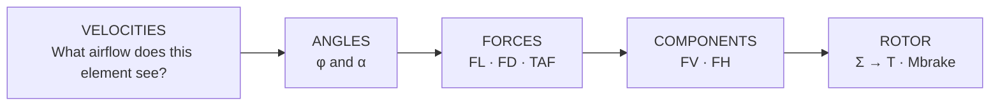
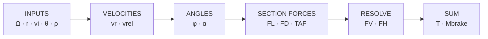

# Module 1 — Visual System & Storyboard

> **Prototype visual language for Subject 082**  
> One model, progressively revealed across instructor visuals, handbook and HeliLab.

The purpose of this page is to stop Module 1 becoming a conventional slide deck. The lesson uses a **small family of persistent visual models**. New information is added to an existing mental picture wherever possible.

!!! info "Source boundary"
    The aerodynamic relationships below follow the current project textbook. The visual grammar, reveal sequence and screen composition are curriculum-design choices.

## The visual promise

By the end of Module 1, a student should recognise this structure instantly:



The textbook defines BET in essentially this order: local velocity inputs produce **vrel**, flow geometry gives **φ and α**, section aerodynamics give **FL/FD/TAF/FV/FH**, and summation gives rotor thrust and braking torque.

---

# 1 · Common visual grammar

## Reference frames stay stable

For blade-element diagrams:

- local TPP/reference line stays horizontal where practical;
- blade motion/rotational velocity uses one consistent horizontal direction;
- induced/axial velocity is drawn vertically;
- **vrel** is always the vector resultant of the active velocity components;
- chord line is visually distinct from the TPP;
- **θ** is measured between chord/reference plane;
- **φ** is the inflow angle of local relative airflow;
- **α** is the angle between chord and local relative airflow;
- **FL** is normal to vrel;
- **FD** is parallel/opposite to vrel;
- TAF is resolved into **FV** normal to the local TPP and **FH** in-plane.

Do not flip the airflow convention between figures simply to make a drawing fit.

## Progressive reveal convention

Every core figure can exist in four states:

**GHOST → PREDICT → REVEAL → TRANSFER**

- **Ghost:** geometry/context only; answer-bearing vectors are absent or muted.
- **Predict:** one changed input is highlighted; student commits.
- **Reveal:** required vectors/angles appear.
- **Transfer:** same visual grammar, different condition.

## Label hierarchy

1. **Physical object / context** — helicopter, rotor, blade element
2. **Inputs** — ρ, Ω, r, vi, θ
3. **Constructed quantities** — vrel, φ, α
4. **Local outputs** — FL, FD, TAF, FV, FH
5. **Whole-rotor outputs** — T, Mbrake

This hierarchy should also become the HeliLab information architecture.

---

# 2 · Fifteen core visuals

## V01 · Stable hover — the unresolved problem

**Question on screen:**  
*Rotor RPM is constant. The pilot raises collective. What changes first?*

**Composition:** side/three-quarter helicopter in stable HOGE; rotor disc visible; small collective control inset. No airflow arrows and no force solution.

**Reveal states:**

1. stable hover only;
2. collective input highlighted;
3. four empty causal slots appear: `? → ? → ? → rotor consequence`;
4. at lesson end, slots are replaced by the student's reconstructed BET chain.

**Do not show:** “collective → thrust” arrow. The visual exists to expose that shortcut.

---

## V02 · Air can produce force

**Question:** *What property of air makes aerodynamic force possible?*

Use a minimal moving-air mass concept rather than a meteorology diagram. Show a control volume / stream of air being deflected and a reaction on the surface. Density appears as **mass per volume**, not as a long ISA treatment.

**Purpose:** bridge “air is invisible” to “changing momentum requires force”.

---

## V03 · Dynamic pressure — speed matters quadratically

**Core expression:** **q = ½ρv²**

**Screen:** two otherwise identical local flow cards:

`A: v = 50 m/s`  versus  `B: v = 100 m/s`

Before reveal, the force/dynamic-pressure comparison is `?`.

After commitment, reveal:

`v ×2 → q ×4` when ρ is unchanged.

A secondary density toggle later shows `ρ ↓ → q ↓` for fixed v.

---

## V04 · The local aerofoil reference frame

Start almost empty:

```text
relative airflow  ─────────────►

                    ______
                 __/      \__
                /____________\
                     chord
```

Build only:

1. blade section;
2. chord line;
3. local relative airflow **vrel**;
4. angle between them **α**.

**Key caption:** *AOA is defined locally, relative to the airflow seen by this blade section.*

---

## V05 · θ is not α

This is the first deliberately comparative visual.

**Left panel — pitch changes:** airflow direction fixed; chord rotates → θ and α change.

**Right panel — airflow changes:** chord/θ fixed; vrel rotates → α changes without a pitch change.

Bottom statement appears only after prediction:

**AOA can change without AOI changing.**

This visual should later morph directly into V10/V11 rather than being discarded.

---

## V06 · Local forces belong to local airflow

Use the V04 blade section and add sequentially:

1. **FL ⟂ vrel**;
2. **FD ∥ vrel** and opposite the aerodynamic relative-flow direction;
3. vector resultant **TAF**.

Then rotate the complete local-airflow geometry slightly while keeping the page reference fixed.

**Prompt:** *Did “lift” remain vertical?*

This is the visual correction for “lift = up / drag = aft”.

---

## V07 · Increasing α — until the model changes

One combined qualitative graphic:

- horizontal axis α;
- CL rises approximately linearly in the pre-stall region;
- a clearly marked **αcrit** region;
- beyond it: separation increases, CL falls and drag rises sharply.

Beside the graph, use three blade-section mini-states:

**attached → separation growing → substantially separated**.

**Do not teach a universal αcrit number.** The source treats critical AOA as profile/Reynolds dependent.

**Prompt before reveal:** *What physical event makes the pre-stall trend stop working?*

---

## V08 · Why Blade Element Theory is needed

Top-down rotor/blade with three highlighted radial stations:

`0.25R   0.60R   0.90R`

All share the same Ω. Ask which sees the greatest rotational velocity.

The visual should make radius spatially obvious before any equation appears.

---

## V09 · Rotational velocity grows with radius

Overlay V08 with local tangential vectors of visibly increasing length.

Reveal:

**vr = Ωr**

Then add a small qualitative strip below:

`r ↑ → vr ↑ → qlocal tends to ↑`

**Caution:** do not conclude “therefore maximum lift is at the tip”. The textbook explicitly notes tip-vortex effects reduce effective AOA near the tip, so useful loading does not simply peak at the tip.

---

## V10 · Build the velocity triangle

This becomes the **master Module 1 technical figure**.

Start with local TPP and blade element. Build in this exact order:

1. **vr = Ωr**;
2. **vi** (or applicable axial component);
3. vector resultant **vrel**;
4. angle **φ** between the local TPP/rotational direction and vrel.

Do not add forces yet.

### Prediction state

Hold vr and θ fixed. Increase vi.

Student must predict:

`φ ?`

Then reveal the steeper velocity triangle.

---

## V11 · α = θ − φ

Reuse V10 without changing its geometry. Add the blade chord at **θ**.

Highlight three angle arcs separately:

- θ — AOI/pitch;
- φ — INFLOW;
- α — effective AOA.

Then reveal:

**AOA = AOI − INFLOW**  
**α = θ − φ**

### Two-state comparison

`State A: vi`  
`State B: vi ↑, θ constant`

Student prediction:

**φ ↑ → α ↓**

The point is causal geometry, not memorising the equation.

---

## V12 · From local airflow to useful and resisting force

Reuse V11. Add:

1. FL normal to vrel;
2. FD parallel/opposite vrel;
3. TAF;
4. resolve TAF into:
   - **FV** normal to local TPP;
   - **FH** in the TPP plane.

Side labels:

`FV → thrust-producing contribution`  
`FH → torque/power-related contribution`

**Prompt:** *Which of these is whole-rotor thrust?*

Correct answer: neither by itself; these are local blade-element quantities.

---

## V13 · Local does not equal rotor

Zoom out from one V12 element to many small elements along the blades.

Animation/storyboard:

`one element → many radial elements → all blades/azimuths → Σ`

Then:

**Σ FV → T**  
**Σ(FH · r) → Mbrake**

This visual is crucial because the textbook explicitly warns against confusing a high local force with whole-rotor thrust.

---

## V14 · BET — one reusable reasoning machine

Full chain, but still no detailed flight-regime answer:



Under it, the question that will recur throughout the course:

> **Which input changed, and can you propagate that change through the model?**

Later modules should reuse V14 and alter the active inputs rather than inventing a new explanation framework for every flight regime.

---

## V15 · Before / after — collective raised

Return to V01. Put the student's original chain on the left and an empty structured BET chain on the right.

Right side prompts:

`θ ↑ → ? → ? → ? → rotor tendency`

The student completes it. Only after commitment is the reference explanation available.

This is a **learning-evidence visual**, not merely a summary slide.

---

# 3 · The three master figures

Although fifteen teaching visuals are listed, only three should require substantial technical illustration effort.

### Master A — Local aerofoil

Feeds **V04, V05, V06, V07**.

### Master B — BET blade element / velocity triangle

Feeds **V10, V11, V12** and most later helicopter-flight modules.

### Master C — Local-to-rotor summation

Feeds **V08, V09, V13, V14**.

**Recommendation:** produce these three first as clean editable SVGs. Derive lesson states from them. Do not create fifteen unrelated illustrations.

---

# 4 · HeliLab mapping

| Visual model | HeliLab use | Interaction |
|---|---|---|
| V03 | M1-01 | ρ / v controls; predict q/force tendency |
| V05 | M1-02 | independently change θ and flow direction |
| V07 | M1-03 | vary α through attached/stall region |
| V09 | M1-04 setup | select radial station / see vr dependency |
| V10–V12 | **M1-04 core** | build local velocity triangle, angles and forces |
| V13–V14 | M1-04 consequence | connect local result to rotor tendency |
| V15 | post-mission evidence | reconstruct collective causal chain |

HeliLab should therefore not have a different diagram language from the lesson. It should feel as if the instructor's figure has become manipulable.

---

# 5 · Media mapping

The same master figures can make the pre-study and recap media substantially more reliable.

### Pre-study video

Use **V01 → V04 → V05 → V13**, but stop before the complete BET solution. Aim: establish vocabulary and curiosity.

### Post-study recap

Use **V10 → V11 → V12 → V13 → V14 → V15**. Aim: rehearse the complete causal model.

If NotebookLM generates the narration/video structure, the technical diagrams should still come from the approved visual library rather than accepting arbitrary generated aerodynamic geometry as authoritative.

---

# 6 · Visual QA checklist

Before a Module 1 figure is approved:

- [ ] Is the reference airflow convention consistent?
- [ ] Is θ clearly different from α?
- [ ] Is φ measured against the intended reference?
- [ ] Is FL normal to vrel?
- [ ] Is FD aligned with the local relative-flow reference used in the project convention?
- [ ] Are local FV/FH visually separated from whole-rotor T/Mbrake?
- [ ] Does the figure avoid implying that tip velocity alone determines maximum lift?
- [ ] Does stall depend on α/separation rather than a “low speed” label?
- [ ] Can the figure be read at normal desktop width?
- [ ] Is there only one main teaching question per reveal state?
- [ ] Can the same source artwork be reused in handbook, slides and HeliLab?

---

# 7 · Production order

**Now:**

1. Master B — BET blade element / velocity triangle
2. Master A — local aerofoil
3. Master C — local-to-rotor summation
4. derive V01–V15 states
5. implement M1-04 from Master B
6. build instructor deck using the same assets
7. create controlled pre-/post-study media

!!! success "Visual-system decision"
    **We are not designing fifteen slides. We are designing three persistent aerodynamic models and fifteen carefully timed views of them.**
