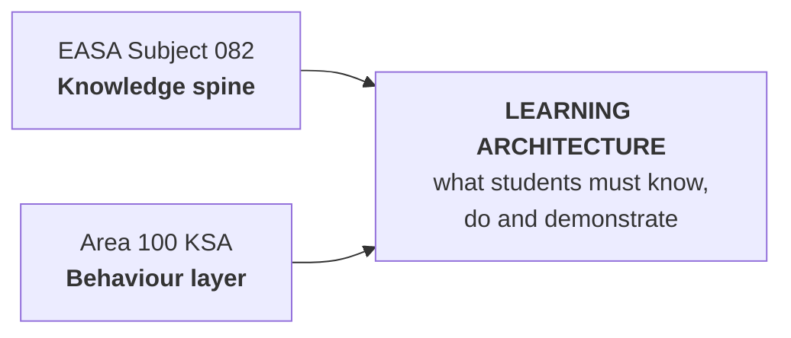
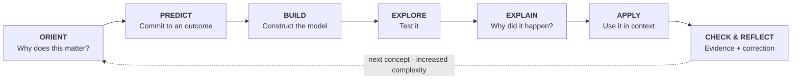
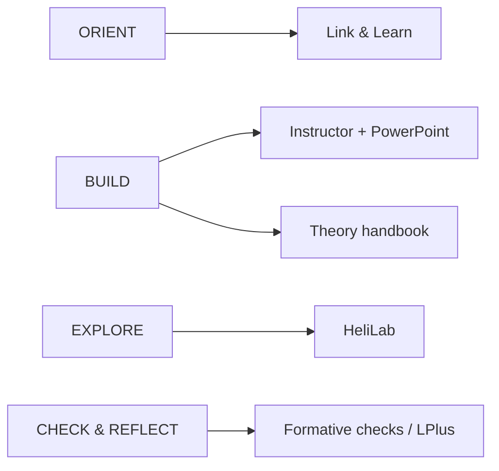

# ATPL(H) Learning Ecosystem

## A visual-first learning system for helicopter ground school

This site is the live design handbook for a modern ATPL(H) learning ecosystem. **082 Principles of Flight — Helicopters** is the first complete implementation and will be used as the blueprint before the architecture is extended to other subjects.

> **Design rule:** diagram first, explanation second.

---

## The idea in one view

The system is deliberately shown in **three readable layers** rather than one wide technical flowchart.

### 1 · Regulatory input → learning architecture

### 2 · The recurring student learning cycle

### 3 · Tools support the learning — they do not define it

The redesign does **not** replace rigorous theory with scenarios. It changes what students repeatedly *do with the theory*: retrieve it, predict with it, test it, explain it and transfer it to changed conditions.

!!! note "Visual design standard"
    A diagram must be readable at normal desktop width without browser zoom. If a process needs more than roughly 6–7 meaningful nodes, it should be split into layers, stages or a dedicated full-width figure. Dense overview diagrams are navigation aids, not places to hide text.

## Three architecture layers

| Layer | Question | Output |
|---|---|---|
| **1. Educational vision** | How should a future helicopter pilot learn to reason aerodynamically? | Principles, KSA integration, learning cycle |
| **2. Curriculum architecture** | What must be learned, in what sequence, and how is mastery evidenced? | 32-hour map, LO traceability, module designs |
| **3. Delivery ecosystem** | Which tool is best for each learning function? | HeliLab, Link & Learn, LPlus, PowerPoint, handbook, GitHub |

## Current build priorities

1. Build the visual ecosystem poster.
2. Freeze the 32-hour Principles of Flight architecture.
3. Map every EASA Subject 082 Learning Objective.
4. Prototype Modules 1–3 in full detail.
5. Define the HeliLab learning modes and mission standard.
6. Define formative assessment, LPlus boundaries and Link & Learn student journey.
7. Publish the complete visual handbook and printable PDF.

## Output model

The repository is the source of truth. From it we aim to generate two primary human-facing products. The detailed production pipeline lives in the architecture section rather than being squeezed into this landing page.

| Source of truth | Living output | Controlled output |
|---|---|---|
| GitHub + Markdown + curriculum data + editable figures | **Live handbook website** | **Versioned handbook PDF** |

The web handbook is the living version. The PDF is the controlled, printable release. Word is treated as an optional export rather than the master source.
