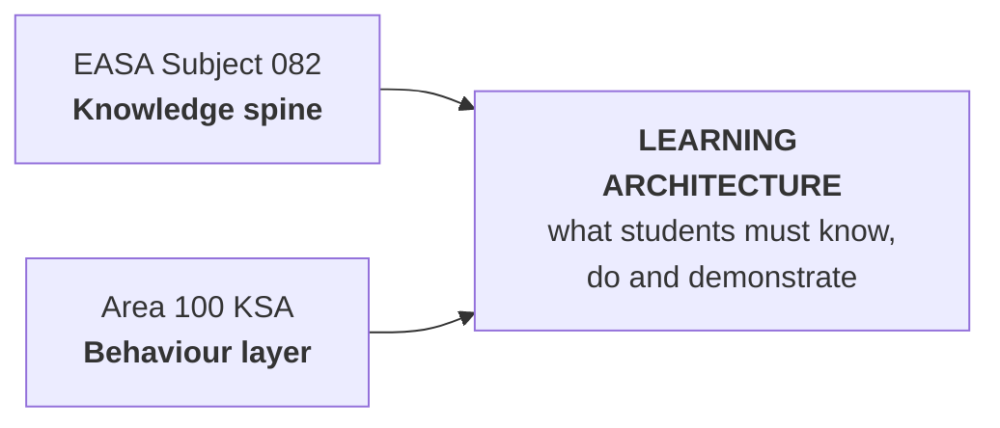
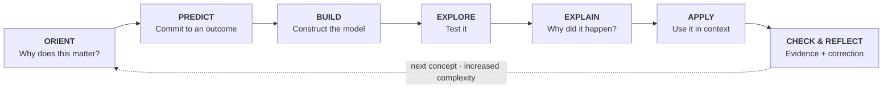
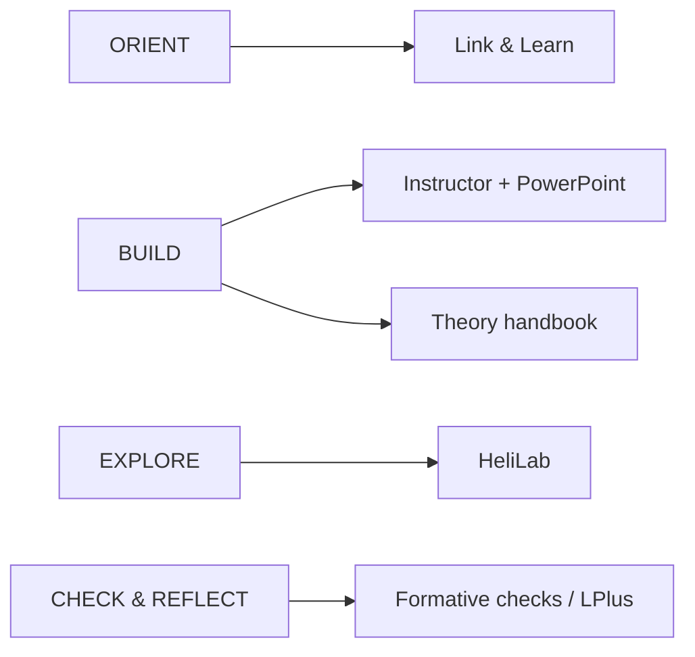

# ATPL(H) Learning Ecosystem

## A visual-first learning system for helicopter ground school

**A visual, evidence-led ATPL(H) ground-school architecture that helps students predict, model, test and explain helicopter flight theory.**

This live design handbook is for **ground-school instructors, curriculum developers, ATO training/quality teams and reviewers**. **082 Principles of Flight — Helicopters** is the first implementation and is being used as the worked blueprint before the architecture is extended to other subjects.

> **The problem:** regulatory coverage can tell us *what* must be taught, but it does not by itself create a coherent mental model or show whether a student can reason with the theory when conditions change.

-   :material-map-outline:{ .lg .middle } **Explore the 32-hour Subject 082 map**

    ---

    See how the regulatory knowledge spine is reorganised into seven connected reasoning modules.

    [:octicons-arrow-right-24: Open curriculum map](curriculum/32-HOUR-CURRICULUM-MAP.md)

-   :material-helicopter:{ .lg .middle } **See a worked module**

    ---

    Follow Module 1 from prediction through theory, HeliLab exploration, explanation and evidence.

    [:octicons-arrow-right-24: Open Module 1](curriculum/MODULE-1-BLUEPRINT.md)

-   :material-flask-outline:{ .lg .middle } **Try HeliLab**

    ---

    Explore the interactive helicopter-aerodynamics concept laboratory used by the curriculum.

    [:octicons-arrow-right-24: Launch HeliLab](https://zanneray.github.io/helilab/HeliLab.html)

!!! info "Current project status"
    **Live now:** learning architecture, 32-hour curriculum map, first EASA LO mapping, student journey and Module 1 worked prototype.  
    **In development:** Modules 2–3, HeliLab learning modes and missions, enriched traceability/evidence view and assessment architecture.  
    **Planned:** Modules 4–7, validation layer, complete visual handbook and controlled PDF release.

> **Design rule:** diagram first, explanation second.

---

## The idea in one view

The system is deliberately shown in **three readable layers** rather than one wide technical flowchart.

### 1 · Regulatory input → learning architecture

### 2 · The recurring student learning cycle

### 3 · Tools support the learning — they do not define it

The redesign does **not** replace rigorous theory with scenarios. It changes what students repeatedly *do with the theory*: retrieve it, predict with it, test it, explain it and transfer it to changed conditions.

!!! note "Visual design standard"
    A diagram must be readable at normal desktop width without browser zoom. If a process needs more than roughly 6–7 meaningful nodes, it should be split into layers, stages or a dedicated full-width figure. Dense overview diagrams are navigation aids, not places to hide text.

## Three architecture layers

| Layer | Question | Output |
|---|---|---|
| **1. Educational vision** | How should a future helicopter pilot learn to reason aerodynamically? | Principles, KSA integration, learning cycle |
| **2. Curriculum architecture** | What must be learned, in what sequence, and how is mastery evidenced? | 32-hour map, LO traceability, module designs |
| **3. Delivery ecosystem** | Which tool is best for each learning function? | HeliLab, Link & Learn, LPlus, PowerPoint, handbook, GitHub |

## Build focus now

The architecture is mature enough to test through real learning design. The immediate focus is therefore **proof rather than more framework**:

1. Make Module 1 the reference worked example.
2. Build Modules 2–3 to the same standard.
3. Establish HeliLab **Model → Explore → Mission → Challenge** modes.
4. Turn LO mapping into visible evidence/traceability.
5. Only then scale the pattern across Modules 4–7 and the wider handbook.

## Output model

The repository is the source of truth. From it we aim to generate two primary human-facing products. The detailed production pipeline lives in the architecture section rather than being squeezed into this landing page.

| Source of truth | Living output | Controlled output |
|---|---|---|
| GitHub + Markdown + curriculum data + editable figures | **Live handbook website** | **Versioned handbook PDF** |

The web handbook is the living version. The PDF is the controlled, printable release. Word is treated as an optional export rather than the master source.
